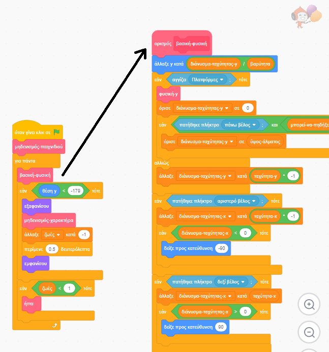

## Πρώτες ρυθμίσεις

Επειδή μαθαίνεις το Scratch και όχι πώς να φτιάξεις μια μηχανή φυσικής (κώδικας που κάνει τα πράγματα να συμπεριφέρονται τουλάχιστον όπως τον πραγματικό κόσμο - π.χ. να μην γίνεται πτώση από τα δάπεδα), θα ξεκινήσεις με ένα έργο που το έχει δημιουργήθεί ήδη να έχει ενσωματωμένα τα βασικά στοιχεία για την κίνηση, το άλμα και τον εντοπισμό πλατφορμών.

Θα πρέπει να του ρίξεις μια γρήγορη ματιά, συμπεριλαμβανομένων των λεπτομερειών σε αυτήν την κάρτα, καθώς θα κάνεις κάποιες αλλαγές αργότερα, αλλά δεν χρειάζεται να καταλάβεις όλα όσα κάνει.

--- task ---

Το πρώτο πράγμα που πρέπει να κάνεις είναι να κάνεις ένα αντίγραφο του κώδικα από την διεύθυνση [dojo.soy/platform-starter](http://dojo.soy/platform-starter){:target="_blank"}

Για να το χρησιμοποιήσεις εκτός σύνδεσης, κάνε λήψη του κώδικα κάνοντας κλικ στο **Δείτε μέσα** και μετά στο μενού **Αρχείο**, και **Αποθήκευση στον υπολογιστή σου**, και στη συνέχεια άνοιξέ το στο Scratch στον υπολογιστή σου.

Μπορείς επίσης να το χρησιμοποιήσεις απευθείας στο Scratch στο πρόγραμμα περιήγησης κάνοντας απλώς κλικ στο **Δείτε μέσα** και στη συνέχεια στο κουμπί **Ανάμειξη**.

--- /task ---

Η μηχανή φυσικής του παιχνιδιού έχει πολλά τμήματα κώδικα, μερικά από τα οποία λειτουργούν, ενώ άλλα όχι. Μπορείς να βρεις ποια, εκτελώντας το παιχνίδι και προσπαθώντας να το παίξεις.

Θα δεις ότι μπορείς να χάνεις ζωές, αλλά τίποτα δε συμβαίνει όταν σου τελειώσουν όλες. Επίσης, το παιχνίδι έχει μόνο ένα επίπεδο, ένα είδος αντικειμένου που μπορείς να συλλέξεις και καθόλου εχθρούς. Θα τα διορθώσεις όλα αυτά, και ακόμη περισσότερα!

--- task ---

Για τώρα, ρίξε μια ματιά στον τρόπο που ο κώδικας συνδυάζεται. Χρησιμοποιεί πολλά μπλοκ από το μενού **Οι Εντολές μου**, τα οποία βοηθούν για να χωρίζεις τον κώδικα σε τμήματα, ώστε να μπορείς να τον διαχειριστείς καλύτερα. Είναι σαν να έχεις ένα μπλοκ που αποτελείται από πολλά άλλα μπλοκ, στα οποία μπορείς να δώσεις μερικές βασικές οδηγίες.

--- /task ---

Στον παραπάνω κώδικα του παιχνιδιού, ο κύριος βρόχος `για πάντα`{:class="block3control"} καλεί το μπλοκ `βασική-φυσική`{:class="block3myblocks"} για να κάνει πολλά πράγματα! Ο διαχωρισμός τους με αυτόν τον τρόπο σε βοηθάει να διαβάζεις πιο εύκολα τον κύριο βρόχο και να κατανοείς τι συμβαίνει στο παιχνίδι, χωρίς να ανησυχείς για το **πώς** συμβαίνει.

Τώρα δες τα μπλοκ `επαναφορά παιχνιδιού`{:class="block3myblocks"} και `επαναφορά χαρακτήρα`{:class="block3myblocks"} και σημείωσε:
    1. Κάνουν διάφορα πραγματάκια, όπως η ρύθμιση των μεταβλητών και η σωστή περιστροφή του χαρακτήρα
    2. Η εντολή `επαναφορά-παιχνιδιού`{:class="block3myblocks"} **καλεί** την `επαναφορά-χαρακτήρα`{:class="block3myblocks"} — που σημαίνει ότι μπορείς να χρησιμοποιείς ένα μπλοκ από τις **Εντολές μου** μέσα σε ένα άλλο μπλοκ από τις **Εντολές μου**!
    3. Η εντολή `επαναφορά-χαρακτήρα`{:class="block3myblocks"} χρησιμοποιείται σε δύο διαφορετικά μέρη, αλλά για να την αλλάξεις, πρέπει μόνο να αλλάξεις τον κώδικά σε ένα από τα μπλοκ στις **Εντολές μου**! Αυτό μπορεί να σου εξοικονομήσει πολλή δουλειά και να σε βοηθήσει να αποφύγεις λάθη.
