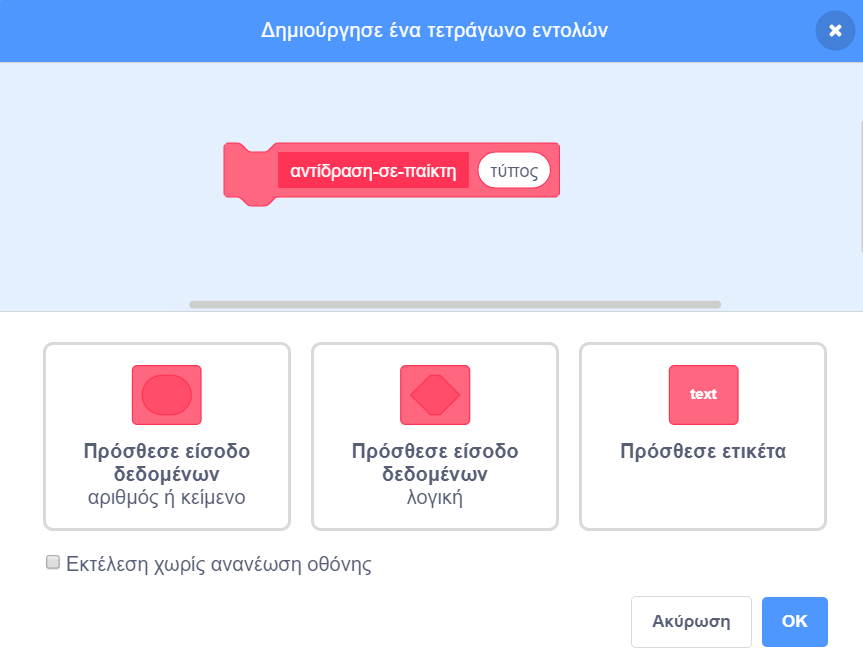

## Βραβεία

Προς το παρόν έχεις μόνο έναν τύπο για τα βραβεία σου: ένα σύννεφο πορδής που όταν το πάρεις κερδίζεις ένα πόντο. Σε αυτήν την καρτέλα, θα δημιουργήσεις έναν νέο τύπο βραβείων, με τρόπο που θα διευκολύνει την προσθήκη κι άλλων τύπων βραβείων. Στη συνέχεια, μπορείς να εμπνευστείς τα δικά σου βραβεία και μπόνους και να κάνεις πραγματικά το δικό σου παιχνίδι!

Έχω ήδη συμπεριλάβει κώδικα για να το κάνεις αυτό με τη μεταβλητή `τύπος-βραβείου`{:class="block3variables"} και το μπλοκ `επιλογή-ενδυμασίας`{: class="block3myblocks"} από τις **Εντολές μου**. Ωστόσο, θα πρέπει να τον βελτιώσεις.

Ας ρίξουμε μια ματιά στο πώς λειτουργεί το βραβείο αυτή τη στιγμή.

Στον κώδικα για το αντικείμενο `Βραβείο`, βρες την εντολή `όταν ξεκινήσω ως κλώνος`{:class="block3events"}. Τα μπλοκ που θέλω να δεις είναι αυτά που σου δίνουν πόντους για τη συλλογή μιας πορδής:

```blocks3
    αν <touching [Player Character v]?> τότε
        άλλαξε [πόντους v] κατά (τιμή-βραβείου ::μεταβλητές)
        διέγραψε αυτόν τον κλώνο
```

και αυτό που επιλέγει μια ενδυμασία για τον κλώνο:

```blocks3
    επιλογή-ενδυμασίας (τύπος-βραβείου ::μεταβλητές) :: προσαρμοσμένο
```

--- collapse ---
---
title: Πώς λειτουργεί η επιλογή ενδυμασίας;
---

Το μπλοκ `επιλογή-ενδυμασίας`{:class="block3myblocks"} λειτουργεί περίπου σαν το μπλοκ `χάνει`{:class="block3myblocks"}, αλλά έχει κάτι επιπλέον: παίρνει μια**παράμετρο** που ονομάζεται `τύπος`.

```blocks3
    όρισε επιλογή-ενδυμασίας (τύπος)
    εαν <(τύπος ::μεταβλητή) = [1]> τότε
        εναλλαγή ενδυμασίας σε [fartCloud v]
    τέλος
```

Όποτε εκτελείται το μπλοκ `επιλογή-ενδυμασίας`{:class="block3myblocks"}, αυτό που κάνει είναι:

 1. Εξετάζει την παράμετρο εισόδου `τύπος`{:class="block3myblocks"}
 1. Εάν η τιμή της `τύπος`{:class="block3myblocks"} είναι `1`, τότε αλλάζει στην ενδυμασία `fartCloud`

Ρίξε μια ματιά στο μέρος του κώδικα που χρησιμοποιεί το μπλοκ:

```blocks3
    όταν εκκινώ ως κλώνος
    επιλογή-ενδυμασίας (τύπος-βραβείου ::μεταβλητές) :: προσαρμογή
    εμφάνιση
    επανάληψη έως <(θέση y) > [170]>
        αλλαγή y κατά (ταχύτητα-βραβείου ::μεταβλητές)
        εάν <0 > τότε
            αλλαγή [πόντοι v] κατά (τιμή-βραβείου ::μεταβλητές)
            διαγραφή κλώνου
```

Μπορείς να δεις ότι η μεταβλητή `τύπος-βραβείου`{:class="block3variables"} **περνάει** στο μπλοκ `επιλογή-ενδυμασίας`{:class="block3myblocks"}. Μέσα στον κώδικα του `επιλογή-ενδυμασίας`{:class="block3myblocks"}, ο `τύπος-βραβείου`{:class="block3variables"} χρησιμοποιείται στη συνέχεια ως παράμετρος εισόδου (`τύπος`{:class="block3myblocks"}).

--- /collapse ---

### Πρόσθεσε μια ενδυμασία για το νέο είδος βραβείου

Φυσικά, τώρα το αντικείμενο `Βραβείο` έχει μόνο μια ενδυμασία, αφού υπάρχει μόνο ένας τύπος βραβείου. Αυτό θα το αλλάξεις!

--- task ---

Πρόσθεσε μια νέα ενδυμασία στο αντικείμενο `Βραβείο` για το νέο σου βραβείο. Έχω σχεδιάσει ένα υπερμεγέθες σύννεφο πορδής, αλλά μπορείς να φτιάξεις ό, τι θέλεις!

--- /task ---

--- task ---

Στη συνέχεια, πρέπει να πεις στο μπλοκ `επιλογή-ενδυμασίας`{:class="block3myblocks"} από τις **Εντολές μου** να ορίζει τη νέα ενδυμασία όποτε λαμβάνει τη νέα τιμή για την παράμετρο `τύπος`, όπως αυτό \(χρησιμοποιώντας οποιοδήποτε όνομα ενδυμασίας έχεις εσύ επιλέξει\):

```blocks3
    καθόρισε επιλογή-ενδυμασίας (τύπος)
    αν <(τύπος ::μεταβλητή) = [1]> τότε
        εναλλαγή ενδυμασίας σε [fartCloud v]
    τέλος
+    εάν <(τύπος ::μεταβλητή) = [2]> τότε
        εναλλαγή ενδυμασίας σε [superFart v]
    τέλος
```

--- /task ---

### Υλοποίησε τον κώδικα του βραβείου

Τώρα πρέπει να αποφασίσεις τι θα κάνει το νέο είδος βραβείου. Θα ξεκινήσουμε με κάτι απλό: δίνοντας στον παίκτη μια νέα ζωή. Στην επόμενη κάρτα θα κάνεις κάτι πιο εντυπωσιακό.

--- task ---

Κάνε κλικ στην καρτέλα **Οι Εντολές μου**, και μετά επίλεξε τη **Δημιουργία Εντολής**. Ονόμασε το νέο μπλοκ `αντίδραση-σε-παίκτη`{:class="block3myblocks"} και πρόσθεσε μια **είσοδο δεδομένων** που ονομάζεται `τύπος`{:class="block3myblocks"} .



Πάτησε **ΟΚ**.

--- /task ---

--- task ---

Κάνε το μπλοκ `αντίδραση-σε-παίκτη`{:class="block3myblocks"} είτε να αυξάνει τους πόντους, είτε να αυξάνει τις ζωές του παίκτη, ανάλογα με την τιμή της παραμέτρου `τύπος`{:class="block3myblocks"} .

```blocks3
+    καθόρισε αντίδραση-στον-παίκτη (τύπος)
+    εάν <(τύπος ::μεταβλητή) = [1]> τότε
        άλλαξε [πόντους v] κατά (τιμή-βραβείου ::μεταβλητές)
    τέλος
+   εάν <(τύπος ::μεταβλητή) = [2]> τότε
         άλλαξε [ζωές v] κατά [1]
    τέλος
```

--- /task ---

--- task ---

Ενημέρωσε τον κώδικα του `όταν ξεκινήσω ως κλώνος`{:class="block3events"} αντικαθιστώντας το μπλοκ που προσθέτει ένα πόντο, με μια **κλήση** της εντολής `αντίδραση-σε-παίκτη`{:class="block3myblocks"} και **περνώντας** ως παράμετρο εισόδου τον `τύπο-βραβείου`{:class="block3variables"}. Χρησιμοποιώντας αυτό το μπλοκ από τις **Εντολές μου**, τα κανονικά σύννεφα πορδής εξακολουθούν να προσθέτουν ένα πόντο και το νέο βραβείο προσθέτει μια ζωή.

```blocks3
    αν <touching [Player Character v] ?> τότε
+        αντίδραση-σε-παίκτη (τιμή-βραβείου ::μεταβλητές) :: προσαρμογή
        διαγραφή κλώνου
    τέλος
```

--- /task ---

### Χρησιμοποιώντας τον `τύπο-βραβείου`{:class="block3variables"} για τη δημιουργία διαφορετικών βραβείων με τυχαίο τρόπο

Αυτήν τη στιγμή, ίσως αναρωτιέσαι πώς θα πεις σε κάθε βραβείο τι είδους θα έπρεπε να είναι.

Αυτό το κάνεις ορίζοντας την τιμή του `τύπος-βραβείου`{:class="block3variables"}. Αυτή η μεταβλητή είναι απλώς ένας αριθμός. Όπως έχεις δει, χρησιμοποιείται για να πει στις εντολές `επιλογή-ενδυμασίας`{:class="block3myblocks"} και `αντίδραση-σε-παίκτη`{:class="block3myblocks"} τι ενδυμασία, κανόνες κ.λπ. να χρησιμοποιήσουν σε κάθε βραβείο.

--- collapse ---
---
title: Χρησιμοποιώντας μεταβλητές σε κλώνους
---

Για κάθε κλώνο του αντικειμένου `Βραβείο`, μπορείς να ορίσεις μια διαφορετική τιμή για το `τύπος-βραβείου`{:class="block3variables"}.

Σκέψου το σαν να δημιουργείς ένα νέο αντίγραφο του αντικειμένου `Βραβείο` με χρήση της τιμής που είναι αποθηκευμένη στο `τύπος-βραβείου`{:class="block3variables"} τη στιγμή που δημιουργείται ο κλώνος από το `Βραβείο`.

Ένα από τα πράγματα που κάνουν τους κλώνους ξεχωριστούς είναι ότι δεν μπορούν να αλλάξουν τις τιμές των μεταβλητών με τις οποίες ξεκινούν. Έχουν ουσιαστικά **σταθερές** τιμές. Αυτό σημαίνει ότι όταν αλλάζεις την τιμή του `τύπος-βραβείου`{:class="block3variables"}, αυτό δεν επηρεάζει τους κλώνους του αντικειμένου `Βραβείο` που βρίσκονται ήδη στο παιχνίδι.

--- /collapse ---

Πρόκειται να ορίσεις τον `τύπο-βραβείου`{:class="block3variables"} σε `1` ή `2` για κάθε νέο κλώνο που δημιουργείς. Ας επιλέξουμε τον αριθμό τυχαία, για να κάνουμε ένα τυχαίο βραβείο κάθε φορά ώστε να γίνει το παιχνίδι ενδιαφέρον.

--- task ---

Βρες το βρόχο `επανάλαβε ώσπου`{:class="block3control"} μέσα στον κώδικα της πράσινης σημαίας για το αντικείμενο `Βραβείο` και πρόσθεσε τον κώδικά `εάν...αλλιώς`{:class="block3control"} που φαίνεται παρακάτω.

```blocks3
    επανέλαβε έως <not <(create-collectables ::variables) = [true]>>
+        εάν <[50] = (τυχαία επιλογή (1) έως (50))> τότε
            όρισε [τύπος-βραβείου v] σε [2]
        αλλιώς
            όρισε [τύπος-βραβείου v] σε [1]
        τέλος
        περίμενε (συχνότητα-βραβείου ::μεταβλητές) δευτερόλεπτα
        μετάβαση στο x: (τυχαία επιλογή (-240) έως (240)) y: (- 179)
        δημιούργησε κλώνο του [εαυτού μου v]
```

--- /task ---

Αυτός ο κώδικας δίνει πιθανότητα 1 προς 50 να οριστεί ο `τύπος-βραβείου`{:class="block3variables"} σε `2`.

Εξαιρετικά! Τώρα έχεις ένα νέο τύπο βραβείου που εμφανίζεται μερικές φορές αντί το σύννεφο πορδής και που σου δίνει μια επιπλέον ζωή αντί για ένα πόντο όταν το παίρνεις!
