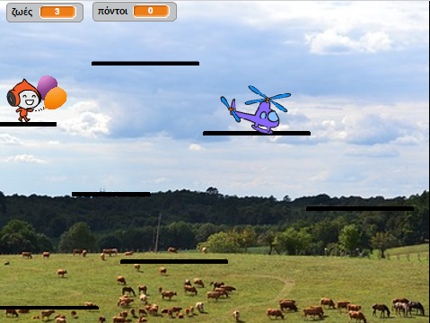

## Περισσότερος ανταγωνισμός

Το παιχνίδι σου λειτουργεί και τώρα μπορείς να συλλέγεις πόντους, να αποκτάς ειδικές δυνάμεις από βραβεία και να χάνεις. Πάμε καλά! Ίσως θα ήταν διασκεδαστικό να προσέθετες και λίγο ανταγωνισμό - τι θα' λεγες να συμπεριλάβεις έναν χαρακτήρα που κινείται λίγο, αλλά που δεν πρέπει να αγγίξεις; Αυτό θα είναι παρόμοιο με τους εχθρούς στα παραδοσιακά παιχνίδια \(όπως το Super Mario\) από το οποίο εμπνεόμαστε εδώ.

--- task ---

Πρώτα, επίλεξε ένα αντικείμενο για να το προσθέσεις ως εχθρό. Επειδή ο χαρακτήρας μας είναι στον ουρανό, επέλεξα ένα ελικόπτερο. Υπάρχουν πολλά άλλα αντικείμενα που μπορείς να προσθέσεις. Ονόμασα επίσης το αντικείμενο `Εχθρός`, για να κάνω τα πράγματα πιο ξεκάθαρα για μένα.

Άλλαξε το αντικείμενο στο σωστό μέγεθος και τοποθέτησε το κάπου κατάλληλα για να ξεκινήσεις. Δες πώς μοιάζει το δικό μου:



--- /task ---

--- task ---

Γράψε πρώτα τον ευκολότερο κώδικα: ρύθμισε το μπλοκ του μηνύματος `τέλος παιχνιδιού`{:class="block3events"} για να εξαφανιστεί ο εχθρός όταν ο παίκτης χάσει.

```blocks3
+ when I receive [τέλος-παιχνιδιού v]
+ hide
```

--- /task ---

--- task ---

Τώρα πρέπει να γράψεις τον κώδικα για το τι κάνει ο εχθρός. Μπορείτε να χρησιμοποιήσεις το δικό μου από αυτήν την κάρτα, αλλά μην φοβάσαι να προσθέσεις περισσότερα! (Τι γίνεται αν τηλεμεταφερθούν σε διαφορετικές πλατφόρμες; Ή τι θα συμβεί αν υπάρχει ένα βραβείο που τους κάνει να κινούνται πιο γρήγορα ή πιο αργά;)

```blocks3
+    when green flag clicked
+    show
+    set [βήματα-κίνησης-εχθρού v] to [5]
+    set rotation style [left-right v]
+    go to x: (1) y: (59)
+    forever
        move (βήματα-κίνησης-εχθρού) steps
        if <not <touching [Πλατφόρμες v] ?>> then
            set [βήματα-κίνησης-εχθρού v] to ((βήματα-κίνησης-εχθρού) * (-1))
        end
    end
```

**Σημείωση**: αν απλώς σύρεις το μπλοκ `πήγαινε σε θέση`{:class="block3motion"} και δεν αλλάξεις τις τιμές `x` και `y`, αυτές θα είναι οι τιμές για την τρέχουσα τοποθεσία του αντικειμένου!

--- /task ---

Ο κώδικάς στο μπλοκ `εάν...τότε`{:class="block3control"} θα κάνει τον εχθρό να γυρίσει ανάποδα όταν φτάσει στο τέλος της πλατφόρμας.

Το επόμενο πράγμα που θα χρειαστείς είναι ο παίκτης να χάσει μια ζωή όταν αγγίξει τον εχθρό. Πρέπει να βεβαιωθείς ότι **σταματά** να αγγίζει πολύ γρήγορα, ωστόσο, διαφορετικά ο κώδικας επαφής θα συνεχίσει να εκτελείται και θα συνεχίσει να χάνει ζωές.

--- task ---

Δες πώς το έκανα, αλλά είσαι ελεύθερος να προσπαθήσεις να βελτιώσεις αυτόν τον κώδικα! Τροποποίησα το κύριο μπλοκ για το αντικείμενο `Παίκτης`. Πρόσθεσε τον κώδικα πριν από το μπλοκ `εάν`{:class="block3control"} που ελέγχει εάν έχουν τελειώσει οι ζωές.

```blocks3
+    if <touching [Εχθρός v] ?> then
        hide
        go to x: (-187) y: (42)
        change [ζωές v] by (-1)
        wait (0.5) secs
        show
    end
```

--- /task ---

--- collapse ---
---
title: Δείξε μου ολόκληρο το ενημερωμένο πρόγραμμα
---

Το κύριο μπλοκ του αντικειμένου μου, του χαρακτήρα `Παίκτης`, μοιάζει τώρα:

```blocks3
    when green flag clicked
    επαναφορά-παιχνιδιού :: custom
    forever
        κυρίως-φυσική :: custom
        if <(y position) < [-179]> then
            hide
            επαναφορά-χαρακτήρα :: custom
            change [ζωές v] by (-1 )
            wait (0.05) secs
            show
        τέλος
        if <touching [Εχθρός v] ?> then
            hide
            go to x: (-187) y: (42)
            change [ζωές v] by (-1)
            wait (0.5) secs
            show
        end
        if <(ζωές) < [1]> then
            απώλεια :: custom
        τέλος
    τέλος
```

--- /collapse ---

Ο νέος κώδικας εξαφανίζει τον χαρακτήρα, τον μετακινεί πίσω στην αρχική του θέση, μειώνει τις `ζωές`{:class="block3variables"} κατά `1` και, μετά από μισό δευτερόλεπτο, τον εμφανίζει πάλι.
