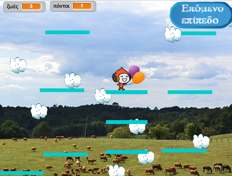

## Κινούμενες πλατφόρμες

Ο λόγος που σου ζήτησα να χρησιμοποιήσεις την έκδοση του επιπέδου 2 είναι το κενό που ίσως έχεις παρατηρήσει στη μέση της διάταξης. Πρόκειται να δημιουργήσεις μια πλατφόρμα που κινείται μέσα από αυτό το κενό και ότι ο παίκτης μπορεί να ανέβει πάνω και να την καβαλήσει!



Πρώτα, θα χρειαστείς το αντικείμενο για την πλατφόρμα.

--- task ---

Πρόσθεσε ένα νέο αντικείμενο με όνομα **Κινούμενη-πλατφόρμα** και χρησιμοποιώντας τα εργαλεία στην καρτέλα Ενδυμασίες κάνε το να μοιάζει με τις άλλες πλατφόρμες \ (χρησιμοποίησε τη λειτουργία διανύσματος - vector\).

--- /task ---

Τώρα, ας προσθέσουμε κώδικα στο αντικείμενο.

Ξεκίνα με τα βασικά: για να δημιουργήσεις ένα ατελείωτο σύνολο πλατφορμών που ανεβαίνoυν στην οθόνη, θα πρέπει να κλωνοποιείς την πλατφόρμα σε τακτά χρονικά διαστήματα. Διάλεξα `4` δευτερόλεπτα ως το διάστημά μου. You also need to make sure that there’s an on/off switch for making the platforms, so that they don’t show up in level 1. I’m using a new variable called `create-platforms`{:class="block3variables"}.

--- task ---

Add code to create clones of your platform sprite.

Here's how mine looks so far:

```blocks3
+    when green flag clicked
+    hide
+    forever
        wait (4) secs
        if <(create-platforms ::variables) = [true]> then
            create clone of [myself v]
        end
    end
```

--- /task ---

--- task ---

Then add the clone's code:

```blocks3
+    when I start as a clone
+    show
+    forever
        if <(y position) < [180]> then
            change y by (1)
            wait (0.02) secs
        else
            delete this clone
        end
    end
```

--- /task ---

This code makes the **Moving-Platform** clone move up to the top of the screen, slowly enough for the player to jump on and off, and then disappear.

--- task ---

Now make the platforms disappear/reappear based on the broadcasts that change levels (so they're only on the level with space for them), and the `game over`{:class="block3events"} message.

```blocks3
+    when I receive [level-1 v]
+    set [create-platforms v] to [false]
+    hide

+    when I receive [level-2 v]
+    set [create-platforms v] to [true]

+    when I receive [game over v]
+    hide
+    set [create-platforms v] to [false]
```

--- /task ---

Now, if you try to actually play the game, the **Player Character** falls through the platform! Any idea why?

It’s because the physics code doesn’t know about the platform. It’s actually a quick fix:

--- task ---

In the **Player Character** sprite scripts, replace every `touching “Platforms”`{:class="block3sensing"}  block with an `OR`{:class="block3operators"} operator that checks for **either** `touching “Platforms”`{:class="block3sensing"}  **OR** `touching “Moving-Platform”`{:class="block3sensing"}.

Go through the code for the **Player Character** sprite and everywhere you see this block:

```blocks3
    <touching [Platforms v] ?>
```

replace it with this one:

```blocks3
    <<touching [Platforms v] ?> or <touching [Moving-Platform v] ?>>
```

--- /task ---
