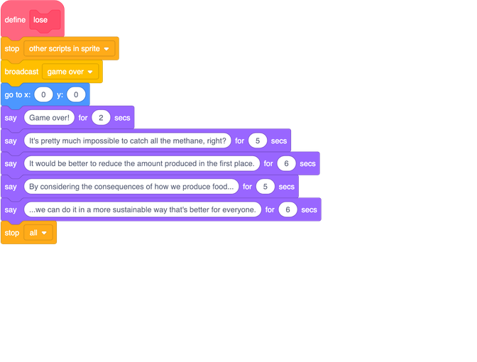
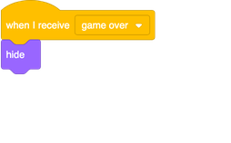
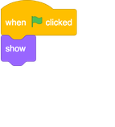
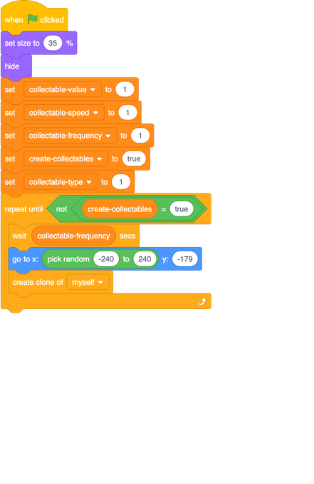
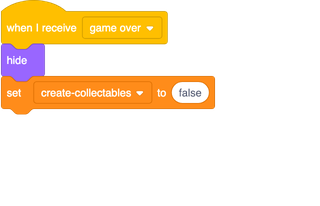

## Losing the game

You may have noticed that the `lose`{:class="block3myblocks"} **My blocks** block on the `Player Character` sprite is empty. You’re going to fill this in and set up all the pieces needed for a nice 'Game over' screen.

+ First, find the `lose` block and complete it with the following code: 

--- collapse ---
---
title: What does the code do?
---

Whenever the `lose`{:class="block3myblocks"} block runs, what it does is: 

 1. Stop the physics and other game scripts on the `Player Character`
 2. Tell all the other sprites that the game is over by **broadcasting** a message so they can change based on that
 3. Move the `Player Character` to the centre of the screen and have them tell the player that the game is over
 4. Stop all scripts in the game

--- /collapse ---

Now you need to make sure all the sprites know what to do when the game is over, and how to reset themselves when the player starts a new game. **Don’t forget that any new sprites you add also might need code for this!**

### Hiding the platforms and edges

+ Start with the easy ones. The `Platforms` and `Edges` sprites both need code for appearing when the game starts and disappearing at 'Game over', so add this to each of them:

### Stopping the farts

Now, for something a little more tricky! If you look at the code for the `Collectable` sprite, you’ll see it works by **cloning** itself. That is, it makes copies of itself that follow the special `when I start as a clone`{:class="block3events"} instructions. 

We’ll talk more about what makes clones special when we get to the card about making new and different collectables. For now, what you need to know is that clones can do **almost** everything a normal sprite can, including receiving `broadcast`{:class="block3events"} messages.

+ Let’s look at how the `Collectable` sprite works. See if you can understand some of its code: 

 1. First it makes the original collectable invisible.
 2. Then it sets up the control variables. We’ll come back to these later.
 3. The `create-collectables`{:class="block3variables"} variable is the on/off switch for cloning: the loop creates clones if `create-collectables`{:class="block3variables"} is `true`, and does nothing if it’s not.

+ Now you need to set up a block on the `Collectable` sprite so that it reacts to the `game over` broadcast:

This code is similar to the code controlling the `Edges` and `Platforms` sprites. The only difference is that you’re also setting the `create-collectables`{:class="block3variables"} variable to `false` so that no new clones are created when it's 'Game over'. 
 
+ Note that you can use this variable to pass messages from one part of your code to another! 
