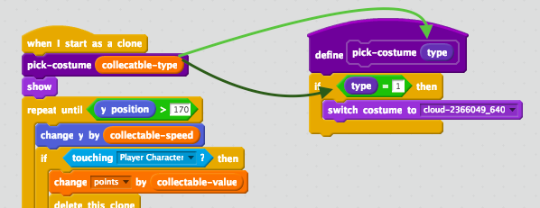
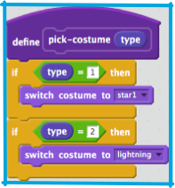
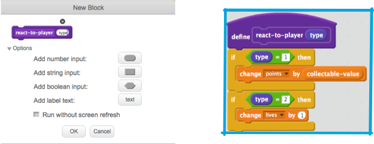
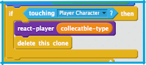

## Powerups

On the last card you saw the collectable I created. It’s a star that just adds one point when you grab it. That’s pretty boring.

On this card, you’re going to create a new collectable, but you’re going to do it in a way that makes adding more collectables easy, so you can invent your own powers and bonuses and really make the game your own!

+ Add a new costume to the `Collectable` sprite for your new power-up. I like the lightning bolt, but pick whatever you like.

Notice that I’ve already included some pieces to make this easier for you with the `collectable-type`{:class="blockdata"} variable and the `pick costume`{:class="blockmoreblocks"} **more block**. You’re going to need to improve on them though. 



In the code above, `collectable-type`{:class="blockdata"} is **passed** to `pick-costume`{:class="blockmoreblocks"} when it’s **called**, where it becomes `type` and can be used inside the **more block**

+ First, you need to set the collectable type. It’s just a number, used to tell the program what costume, rules etc. to use for the collectable. You’re going to want to pick it at random, to keep things interesting. This example gives a 1/50 chance: 

```blocks
    repeat until <not <(create-collectables) = [true]>>
        if <[50] = (pick random (1) to (50))> then
            set [collectable-type v] to [2]
        else
            set [collectable-type v] to [1]
        end
        wait (collectable-frequency) secs
        go to x: (pick random (-240) to (240)) y: (179)
        create clone of [myself v]
```


--- collapse ---
---
title: Pro Tip!
---

There can be a different value set as the `collectable-type`{:class="blockdata"} for each clone. 

Think of it like creating a new copy of the variable on the main `Collectable` sprite with the value that was in `collectable-type`{:class="blockdata"} the instant that clone was created. 

One of the things that makes clones special is that they cannot change the values of any variables they start with. They are effectively **constant** values.

--- /collapse ---

Great! Now you’re setting a different value for the collectable type, but none of the code knows what to do with it yet! 

+ First, just teach the `pick-costume`{:class="blockmoreblocks"} **more block** to set the new costume when it gets the new type, like this \(using whatever costume you picked\): 

```blocks
    define pick-costume (type)
    if <(type) = [1]> then
        switch costume to [star1 v]
    end
    if <(type) = [2]> then
        switch costume to [lightning v]
    end
```



Now you need to decide what the powerup will do. We’ll start with something simple: giving the player a new life. On the next card, you’ll make it do something cooler. 

### To create the powerup code

+ Go into **more blocks** and **Make a Block**. Name the block `react-to-player`.

+ Expand the **Options** section and add a **number input**. Name it `type`. 

+ Make the `react-to-player` block either give the same points prize that the star is already giving, or increase the player’s lives, depending on the `type` of powerup.  



+ Update the `when I start as a clone`{:class="blockcontrol"} code to replace the points increase with a **call** to `react-to-player`{:class="blockmoreblocks"}, **passing** `collectable-type`{:class="blockdata"}. Stars still boost points but the new powerup adds lives. 

```blocks
    if <touching [Player Character v] ?> then
        react-player (collectable-type)
        delete this clone
    end
```



