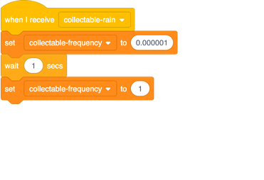
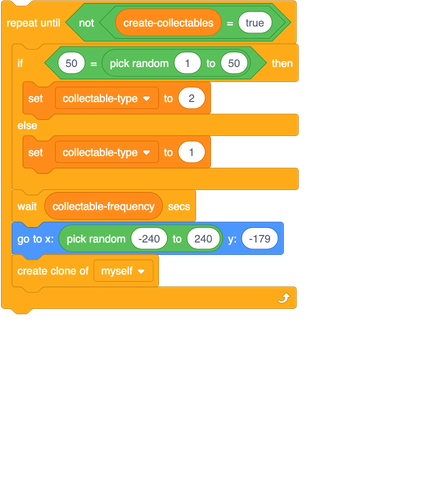
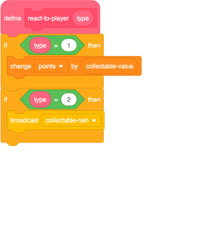

## Super power-ups!

Now that you have a new power-up working, it’s time to make it do something cool! Let's make it 'rain' power-ups for a few seconds, instead of just giving out an extra life.
 
For this you need to create another piece of code that will start while the `react-to-player`{:class="block3myblocks"} block finishes running. To make that happen, you'll use a `broadcast`{:class="block3events"} block to send a message to another piece of code inside this sprite. 

+ Create this block for the `Collectable` sprite. Let’s call the broadcast `collectable-rain`{:class="block3events"}.

--- collapse ---
---
title: What does the new code do?
---

This block just sets `collectable-frequency`{:class="block3variables"} to a very small number \(change it to different values and see what happens!\) and then waits a second and changes it back to `1`.

This doesn’t look like it should do much, but think about what’s happening during that second: the `when green flag clicked`{:class="block3events"} code is still running, and the `repeat until`{:class="block3control"} loop in it is looping. Look at the code in that loop: 

You can see that the `wait` block here pauses the code for the length of time set by `collectable-frequency`{:class="block3variables"}. So if the value of `collectable-frequency`{:class="block3variables"} changes to `0.000001`, the `wait` block only pauses for **one millionth** of a second, meaning that the loop will run many more times than normal. As a result, the code is going to create **a lot** more power-ups than it normally would, until `collectable-frequency`{:class="block3variables"} changes back `1`. Can you think of any problems that might cause? There’ll be a lot more super-farts…what if you kept catching them?

--- /collapse ---

Now you have the sprite ready to receive the `collectable-rain`{:class="block3events"} broadcast block, but you haven't made code for sending the broadcast yet. 

+ This next part’s easy. Just update the `react-to-player`{:class="block3myblocks"} block to look like this, so it broadcasts `collectable-rain`{:class="block3events"} when the player touches a type `2` power-up. 

### Challenge: get creative!
 
+ Based on this card and the previous one, you can now make as many different power-ups as you want! What about one that gives out 20 times the usual number of points, or adds three lives, or makes it so the player can’t run out of lives for a period of time? Come up with some cool power-ups and see if you can make them!
