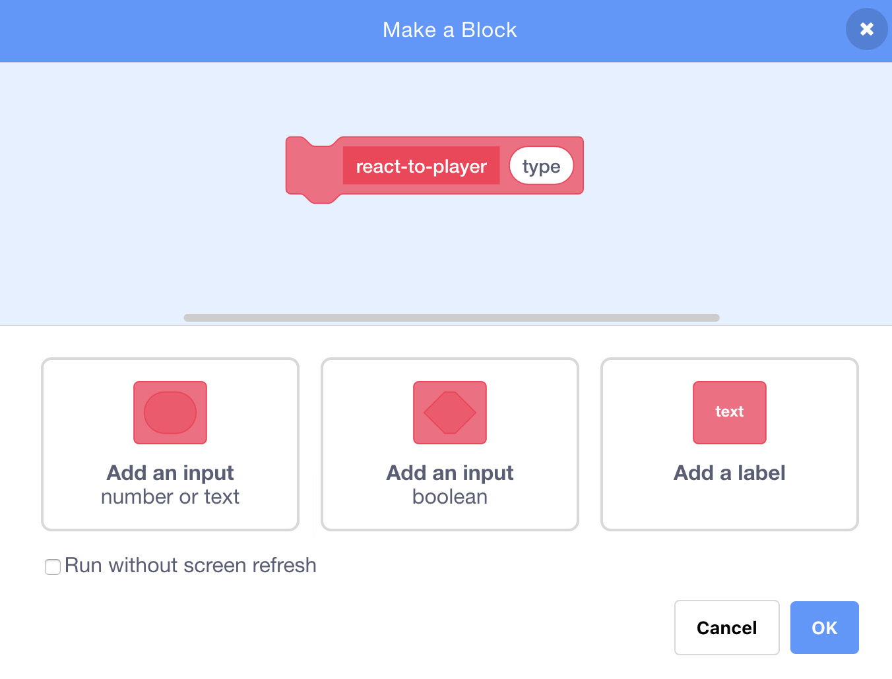
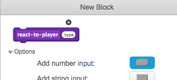

## Power-ups

On the last card you saw the collectable I created. It’s a fart cloud that just adds one point when you grab it. That’s pretty boring.

On this card, you’re going to create a new collectable, but you’re going to do it in a way that makes adding more collectables easy, so you can invent your own power-ups and bonuses and really make the game your own!

+ Add a new costume to the `Collectable` sprite for your new power-up. I've drawn a supersize fart cloud, but you can make whatever you like!

I’ve already included some pieces to make this easier for you with the `collectable-type`{:class="blockdata"} variable and the `pick costume`{:class="blockmoreblocks"} **More** block. You’re going to need to improve on them though. 

First, you need to set the `type`. It’s just a number used to tell the program what costume, rules, etc. to use for the collectable. You’re going to want to pick the number at random to keep things interesting. 

+ Find the `repeat until`{:class="blockcontrol"} loop inside the green flag code for the `Collectable` sprite and add the `if...else`{:class="blockcontrol"} code shown below.

```blocks
    repeat until <not <(create-collectables) = [true]>>
        if <[50] = (pick random (1) to (50))> then
            set [collectable-type v] to [2]
        else
            set [collectable-type v] to [1]
        end
        wait (collectable-frequency) secs
        go to x: (pick random (-240) to (240)) y: (179)
        create clone of [myself v]
```

This example gives a 1 in 50 chance of setting the `collectable-type`{:class="blockdata"} to `2`.

--- collapse ---
---
title: Pro tip!
---

You can set a different value as the `collectable-type`{:class="blockdata"} for each clone. 

Think of it like creating a new copy of the variable on the main `Collectable` sprite with the value that was in `collectable-type`{:class="blockdata"} the instant that clone was created. 

One of the things that makes clones special is that they cannot change the values of any variables they start with. They are effectively **constant** values.

--- /collapse ---

Great! Now you’re setting a different value for the collectable type, but none of the code knows what to do with it yet! 

+ First, just teach the `pick-costume`{:class="blockmoreblocks"} **More** block to set the new costume when it gets the new type, like this \(using whatever costume you picked\): 

```blocks
    define pick-costume (type)
    if <(type) = [1]> then
        switch costume to [fartCloud v]
    end
    if <(type) = [2]> then
        switch costume to [superFart v]
    end
```

Now you need to decide what the power-up will do. We’ll start with something simple: giving the player a new life. On the next card, you’ll make it do something cooler. 

### Create the power-up code

+ Go into the **More** section and click **Make a Block**. Name the new block `react-to-player`{:class="blockmoreblocks"}.



+ Expand the **Options** section and add a **number input**. Name it `type`.



+ Click **OK**. 

+ Make the `react-to-player`{:class="blockmoreblocks"} block either increase the points or increase the player’s lives, depending on the `type` of power-up.  

```blocks
    define react-to-player (type)
    if <(type) = [1]> then
        change [points v] by (collectable-value)
    end
    if <(type) = [2]> then
        change [lives v] by [1]
    end
```

+ Update the `when I start as a clone`{:class="blockevents"} code to replace the points increase with a **call** to `react-to-player`{:class="blockmoreblocks"}, **passing** `collectable-type`{:class="blockdata"}. Normal fart clouds still boost points but the new power-up adds lives. 

```blocks
    if <touching [Player Character v] ?> then
        react-to-player (collectable-type) :: custom
        delete this clone
    end
```
