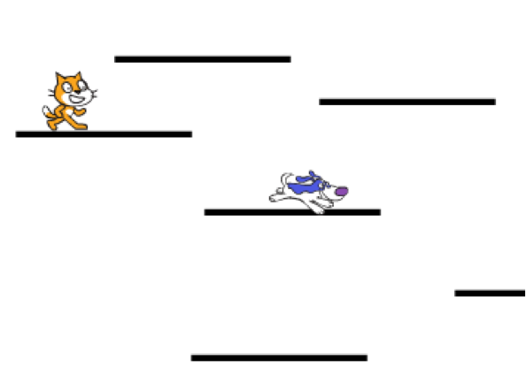
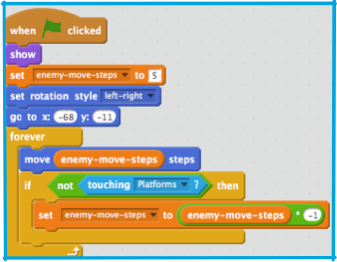
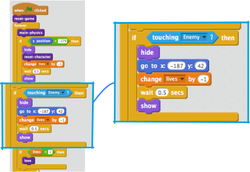

## Adding some competition

Your game works and now you can collect points, get special powers from powerups and lose. We’re getting somewhere! Maybe it’d be fun to add some competition though… what about including a character who moves around a little, but you can’t touch? Like the enemies in the traditional platformer games \(like Super Mario\) we’re being inspired by here.

+ Well, first, pick your enemy and add their sprite. Because our character is a cat, I chose a dog. There are lots of other sprites you could add though. I also renamed the sprite to `Enemy` just to make things clearer for me.

+ Resize the sprite to the right size and place it somewhere appropriate to start. Here’s what mine looks like: 

+ Write the easier code first: Setup the block for the `game over` message, so the enemy will disappear when the player loses the game. 

+ Now you need to write the code for what the enemy does. You can use mine from this card, but don’t be afraid to add more! What if they teleport around to different platforms? Or what if there’s a powerup that makes them move faster, or slower? 

If you just drag the `go to` block and don’t change the x & y values, they’ll be the values for the current location of the sprite!
 
The code in the `if.. then` block will make the enemy turn around when they get to the end of the platform!

+ The next thing you’ll need is for the player to lose a life when they touch the enemy. You need to make sure they **stop** touching really quickly, though, since otherwise the touching code will keep running and they’ll keep losing lives. Here's how I did it, though feel free to try to improve on it! I modified the `Player Character` sprite’s main block. 

The new code hides the character, moves them back to their starting position, reduces lives by one and, after half a second, makes them re-appear.