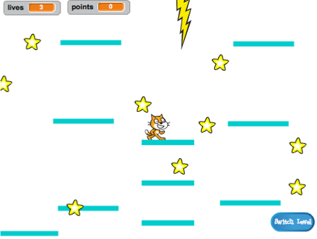
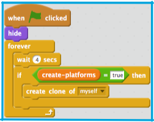
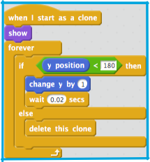
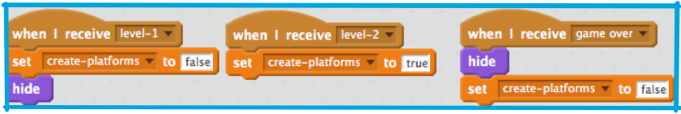
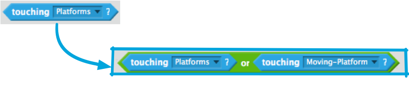

## Moving platforms

The reason I asked you to use my version of level 2 is the gap you might have noticed in the middle. You’re going to create a platform that moves through that gap, that the player can jump onto and ride. 

+ First, you’ll need the sprite for the platform. You can create this by adding any sprite, naming it `Moving-Platform` and using the costume customisation tools in the **costumes** tab to make it look like the other platforms \(use vector mode\).

Time to start adding some code! 

+ Begin with the basics: To make a never-ending set of platforms moving up the screen, you’ll need to **clone** the platform at some sort of interval. I picked 4 seconds. 

+ You also need to make sure that there’s an on/off switch for making the platforms, so they don’t show up on level 1. I’m using a **variable** called `create-platforms`. 

+ The clone’s code is simple: Move up to the top of the screen, slowly enough for the player to jump on and off, and then disappear. 

+ You need to make the platforms disappear/reappear based on the level changing events and on the `game over` event. 

+ Now, if you try to actually play the game, the Player Character falls through the platform! Any idea why? 

It’s because the physics code doesn’t know about the platform. It’s actually an easy fix: Go through the code on the “Player Character” sprite and replace every `touching “Platforms”` with an `OR` operator, where you check for **either** `touching “Platforms”` **OR** `touching “Moving Platform”` 
 

