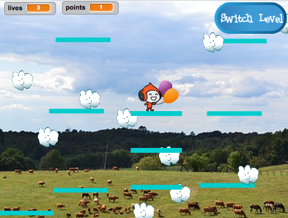
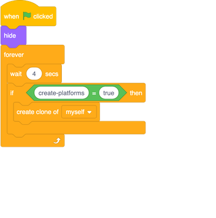
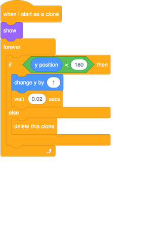
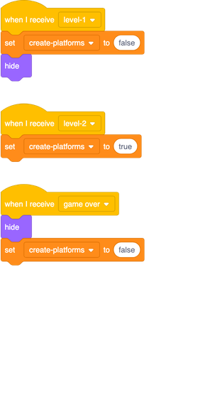

## Moving platforms

The reason I asked you to use my version of level 2 is the gap you might have noticed in the middle of the layout. You’re going to create a platform that moves through this gap and that the player can jump on and ride. 

+ First, you’ll need the sprite for the platform: add a new sprite, name it `Moving-Platform`, and using the costume customisation tools in the Costumes tab to make it look like the other platforms \(use vector mode\).

Now let's adde some code! 

+ Begin with the basics: to make a never-ending set of platforms moving up the screen, you’ll need to clone the platform at regular intervals. I picked 4 seconds. You also need to make sure that there’s an on/off switch for making the platforms, so that they don’t show up in level 1. I’m using a variable called `create-platforms`{:class="block3variables"}. 

Here's how my code looks so far for the new sprite:

+ Then add the clone's code:

This code is simple: it makes the clone move up to the top of the screen, slowly enough for the player to jump on and off, and then disappear. 

+ You need to make the platforms disappear/reappear based on the broadcasts that change levels and the `game over` message. 

+ Now, if you try to actually play the game, the player character falls through the platform! Any idea why? 

It’s because the physics code doesn’t know about the platform. It’s actually an easy fix: on the `Player Character` sprite, replace every `touching “Platforms”`{:class="block3sensing"}  block with an `OR`{:class="block3operators"} operator that checks for **either** `touching “Platforms”`{:class="block3sensing"}  **OR** `touching “Moving-Platform”`{:class="block3sensing"}.
 
+ Go through the code on the `Player Character` sprite and everywhere you see this block:

replace it with this one:

