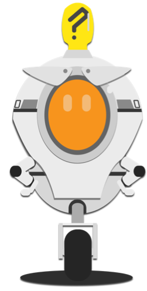

## What next?

You’ve got a game now! But there’s still a lot more you can do with it! Here’s a few ideas to get you started:
 
--- collapse ---
--- 
title: High Scores
---

+ Keep a list of the names and scores of people who’ve gotten high scores in the game! You’ll need to use the `ask`{:class="blocklooks"} block to the get their name.

--- /collapse ---

--- collapse ---
--- 
title: New Powerups!
---

+ Try adding some new powerups. For example:
  * Immunity to enemies
  * More lives
  * Bigger player character
  * Smaller player character
 
--- /collapse ---

--- collapse ---
--- 
title: Scrolling Levels!
---

+ Can you figure out how to make the levels scroll along, so the player character can move through them from left to right? Or at least _look_ like that’s what’s happening?
 
--- /collapse ---

--- collapse ---
--- 
title: Completing Levels!
---

+ Right now, the levels never end. What if, instead of pushing a button, you needed a certain number of points to get to the next level?
 
--- /collapse ---

--- collapse ---
--- 
title: Play With Physics!
---

+ Try changing some of the values in the physics engine, like the gravity, jump height, x-speed and y-speed. How do they change the game? 
 Can you use them to make powerups?
 
--- /collapse ---

--- collapse ---
--- 
title: More Levels
---

+ Add more levels! Make better art! By using the stage background, make the game look cooler while still keeping platforms easy to work with as a coder.
 
--- /collapse ---

--- collapse ---
--- 
title: Sound Effects!
---

+ This game is totally silent right now! Try adding background music and sound effects using the blocks in **sound**!
 
--- /collapse ---

--- collapse ---
--- 
title: Secrets!
---

+ Think of secret bonuses, cheat codes and other “easter eggs” you could hide in the game for players to discover. Try to code some of them!
 
--- /collapse ---

--- collapse ---
--- 
title: Different Characters!
---

+ Let the player pick a character. Make them different in things like size, how high they jump, maybe even how many lives they have and points they get from collectables! 

--- /collapse ---

 

