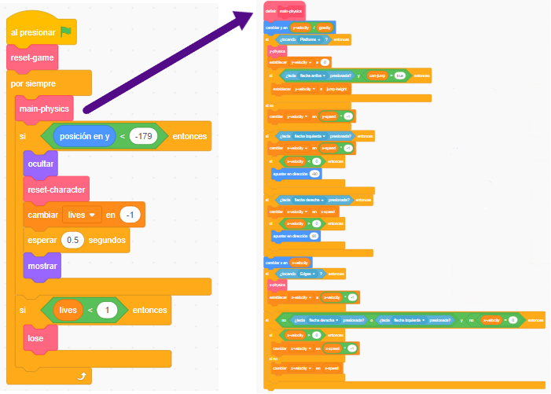

## Preparando todo

Ya que estás aprendiendo a programar en Scratch y no a construir un motor de física (el código que hace que las cosas en un juego de computadora se comporten como objetos del mundo real, por ejemplo, no cayendo por los pisos), comenzarás con un proyecto que he creado que ya tiene lo básico para mover, saltar y detectar plataformas integradas.

Deberías echarle un vistazo rápido, incluyendo los detalles en esta tarjeta, ya que harás algunos cambios más adelante; sin embargo, no es necesario que entiendas todo lo que está haciendo.

--- task ---

Lo primero que deberás hacer es obtener una copia del código de Scratch de [dojo.soy/platform-starter](http://dojo.soy/platform-starter){:target="_blank"}

Para usarlo sin conexión, descarga este código haciendo clic en **Ver dentro**, luego en el menú **Archivo**, y **Guardar en tu computador**, y luego ábrelo en Scratch en tu computadora.

También puedes usarlo directamente en Scratch en tu navegador web, haciendo clic en **Ver dentro** y luego **Reinventar**.

--- /task ---

El motor de física del juego tiene una variedad de piezas, algunas de las cuales funcionan en este momento y otras no. Puedes averiguar cuál ejecutando el juego e intentando jugarlo.

Verás que puedes perder vidas, pero no pasa nada cuando te quedas sin ellas. Además, el juego solo tiene un nivel, un tipo de cosa a recolectar, y no hay enemigos. ¡Vas a arreglar todo eso, y un poco más!

--- task ---

Por ahora, échale un vistazo a cómo se crea el código. Usa muchos bloques **Mis bloques**, que son excelentes para dividir tu código en partes y puedas administrarlo mejor. Es como tener un bloque compuesto por muchos otros bloques, al que puedes dar algunas instrucciones básicas.

--- /task ---

En el código anterior, el ciclo principal `por siempre`{:class="block3control"} del juego llama al bloque `main-physics`{:class="block3myblocks"} para hacer un montón de cosas! Mantenerlos separados de esta manera hace que sea fácil leer el ciclo principal y comprender qué sucede cuándo, sin preocuparse por **cómo** sucede.

Ahora mira los bloques `reset game`{:class="block3myblocks"} y `reset character`{:class="block3myblocks"} y nota que:
    1. Hacen cosas bastante normales, como configurar variables y asegurarse de que el personaje gire correctamente
    2. `reset-game`{:class="block3myblocks"} **llama a** `reset-character`{:class="block3myblocks"}, lo que significa que: ¡Puedes usar un bloque **Mis bloques** dentro de otro bloque **Mis bloques**!
    3. `reset-character`{:class="block3myblocks"} se usa en dos lugares diferentes, ¡pero para cambiarlo solo tienes que cambiar el código del bloque **Mis bloques** en uno! Esto puede ahorrarte mucho trabajo y ayudarte a evitar errores.
