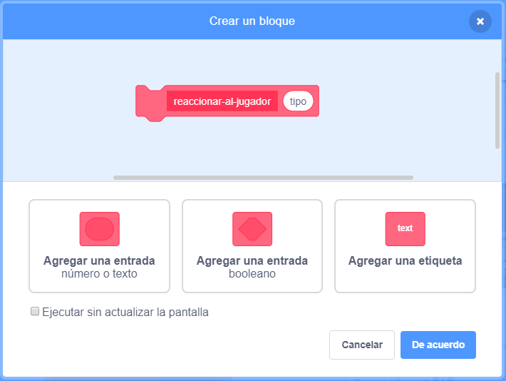

## Recompensas

En este momento, solo tienes un tipo de coleccionable: una nube de gas que te da un punto cuando la atrapas. En esta tarjeta, crearás un nuevo tipo de coleccionable, y lo harás de una manera que facilitará la adición de otros tipos de coleccionables. ¡Luego puedes inventar tus propias recompensas y bonos y realmente hacer que el juego sea tuyo!

Ya he incluido algunas piezas para hacer esto, con la variable `collectable-type`{:class="block3variables"} y el bloque `pick-costume`{:class="block3myblocks"} de **Mis bloques**. Sin embargo, tendrás que mejorarlos.

Echemos un vistazo a cómo funciona el coleccionable en este momento.

En los scripts para el objeto `Collectable`, busca el código `al comenzar como clon`{:class="block3events"}. Los bloques que debes observar son los que te dan puntos por recoger un gas:

```blocks3
    if <touching [Player Character v]?> then
        change [points v] by (collectable-value ::variables)
        delete this clone
```

y este que selecciona un disfraz para el clon:

```blocks3
    pick-costume (collectable-type ::variables) :: custom
```

--- collapse ---
---
title: ¿Cómo funciona elegir un disfraz?
---

El bloque `pick-costume`{:class="block3myblocks"} funciona un poco como el bloque `lose`{:class="block3myblocks"}, pero tiene algo extra: toma una variable de **entrada** llamada `type`.

```blocks3
    define pick-costume (type)
    if <(type :: variable) = [1]> then
        switch costume to [fartCloud v]
    end
```

Siempre que el bloque `pick-costume`{:class="block3myblocks"} se ejecuta, lo que hace es:

 1. Busca la variable de entrada `type`{:class="block3myblocks"}
 1. Si el valor de `type`{:class="block3myblocks"} es igual a `1`, cambia al disfraz de `fartCloud`

Echa un vistazo a la parte del script que utiliza el bloque:

```blocks3
    when I start as a clone
    pick-costume (collectable-type ::variables) :: custom
    show
    repeat until <(posición en y) > [170]>
        change y by (collectable-speed ::variables)
        if <touching [Player Character v]?> then
            change [points v] by (collectable-value ::variables)
            delete this clone
```

Puedes ver que la variable `collectable-type`{:class="block3variables"} es **trasladada** al bloque `pick-costume`{:class="block3myblocks"}. Dentro del código para `pick-costume`{:class="block3myblocks"}, `collectable-type`{:class="block3variables"} se usa entonces como la variable de entrada (`type`{:class="block3myblocks"}).

--- /collapse ---

### Agrega un disfraz para la nueva recompensa

Por supuesto, por ahora el objeto `Collectable` solo tiene un disfraz, ya que solo hay un tipo de coleccionable. ¡Estás a punto de cambiar eso!

--- task ---

Agrega un nuevo disfraz al objeto `Collectable` para tu nueva recompensa. He dibujado una nube de gas de gran tamaño, ¡pero tú puedes hacer lo que quieras!

--- /task ---

--- task ---

A continuación, necesitas decirle al bloque `pick-costume`{:class="block3myblocks"} **Mis bloques** que establezca el nuevo disfraz en cuanto obtenga el nuevo valor para `type`{:class="block3myblocks"}, así \(usando cualquier nombre de disfraz que hayas elegido\):

```blocks3
    define pick-costume (type)
    if <(type :: variable) = [1]> then
        switch costume to [fartCloud v]
    end
+    if <(type :: variable) = [2]> then
        switch costume to [superFart v]
    end
```

--- /task ---

### Crear el código de recompensa

Ahora tienes que decidir qué hará el nuevo coleccionable. Comenzaremos con algo simple: darle al jugador una nueva vida. En el siguiente paso, harás que haga algo más genial.

--- task ---

Ingresa a la sección **Mis bloques** y luego haz clic en **Crear un bloque**. Nombra el nuevo bloque `react-to-player`{:class="block3myblocks"} y agrega una **entrada de número** llamada `type`{:class="block3myblocks"} .



Click **OK**.

--- /task ---

--- task ---

Haz que el bloque `react-to-player`{:class="block3myblocks"} aumente ya sea los puntos o la vida del jugador, dependiendo del valor del `type`{:class="block3myblocks"} .

```blocks3
+    define react-to-player (type)
+    if <(type ::variable) = [1]> then
        change [points v] by (collectable-value ::variables)
    end
+   if <(type ::variable) = [2]> then
        change [lives v] by [1]
    end
```

--- /task ---

--- task ---

Actualiza el código `al comenzar como clon`{:class="block3events"} para reemplazar al bloque que agrega un punto con una **llamada** a `react-to-player`{:class="block3myblocks"}, **pasando** `collectable-type`{:class="block3variables"}. Al usar este bloque **Mis bloques**, las nubes de gas normales aún agregan un punto, y la nueva recompensa agrega una vida.

```blocks3
    if <touching [Player Character v] ?> then
+        react-to-player (collectable-type ::variables) :: custom
        delete this clone
    end
```

--- /task ---

### Usando `collectable-type`{:class="block3variables"} para crear diferentes coleccionables de forma aleatoria

En este momento, es posible que te preguntes cómo le dirás a cada coleccionable que el juego genere, de qué tipo debería ser.

Haces esto al establecer el valor de `collectable-type`{:class="block3variables"}. Esta variable es solo un número. Como has visto, se usa para decirle a los bloques `pick-costume`{:class="block3myblocks"} y `react-to-player`{:class="block3myblocks"} qué disfraz, reglas, etc., deben usar para el coleccionable.

--- collapse ---
---
title: Trabajando con variables en un clon
---

Para cada clon del objeto `Collectable`, puedes establecer un valor diferente para `collectable-type`{:class="block3variables"}.

Piensa en ello como crear una nueva copia del objeto `Collectable` usando el valor almacenado en `collectable-type`{:class="block3variables"} en el momento en que el clon `Collectable` es creado.

Una de las cosas que hace que los clones sean especiales es que no pueden cambiar los valores de ninguna variable con la que comiencen. Los clones de objetos (sprite) tienen valores **constantes**. Eso significa que cuando cambias el valor de `collectable-type`{:class="block3variables"}, esto no afecta a los clones de objeto `Collectable` que ya están en el juego.

--- /collapse ---

Vas a configurar el `collectable-type`{:class="block3variables"} a `1` o `2` por cada nuevo clon que hagas. Vamos a elegir el número al azar, para hacer un coleccionable aleatorio cada vez y mantener las cosas interesantes.

--- task ---

Encuentra el ciclo `repetir hasta que`{:class="block3control"} dentro del código en bandera verde para el objeto `Collectable`, y agrega el código `si...si no`{:class="block3control"} que se muestra a continuación.

```blocks3
repeat until <not <(create-collectables ::variables) = [true]>>
+        if <[50] = (número al azar entre (1) y (50))> then
            set [collectable-type v] to [2]
        else
            set [collectable-type v] to [1]
        end
        wait (collectable-frequency ::variables) secs
        go to x: (pick random (-240) to (240)) y: (-179)
        create clone of [myself v]
```

--- /task ---

Este código ofrece una probabilidad de 1 en 50 de establecer el `collectable-type`{:class="block3variables"} a `2`.

¡Genial! ¡Ahora tienes un nuevo tipo de coleccionable que a veces aparece en lugar de la nube de gas, y que te da una vida extra en lugar de un punto cuando lo recoges!
