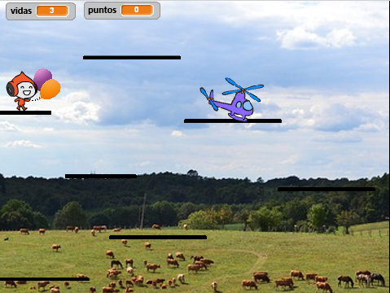

## Añadiendo algo de competencia

Tu juego funciona y ahora puedes recoger puntos, obtener poderes especiales de recompensas y perder. ¡Estamos llegando a algo! Quizás sería divertido añadir algo de competencia, ¿qué tal incluir un personaje que se mueve alrededor, pero que no se supone que toques? Esto será similar a los enemigos en los juegos de plataformas tradicionales, \(como Súper Mario\), en los cuales nos hemos inspirado aquí.

--- task ---

Primero, elige un objeto para agregar como tu enemigo. Como nuestro personaje está en el cielo, yo elegí a un helicóptero. Sin embargo, hay muchos otros objetos que tu podrías añadir. También renombré el objeto `Enemy`, solo para aclarar las cosas para mi.

Cambia el objeto al tamaño correcto y colócalo en un lugar apropiado para comenzar. Así es como se ve el mío:



--- /task ---

--- task ---

Escribe primero el código más fácil: configura su bloque para que el mensaje `fin del juego`{:class="block3events"} haga desaparecer al enemigo cuando el jugador pierde el juego.

```blocks3
+    when I receive [fin del juego v]
+    hide
```

--- /task ---

--- task ---

Ahora necesitas escribir el código de lo que hace el enemigo. Puedes usar el mío de esta tarjeta, ¡pero no tengas miedo de añadir más! (¿Y si pueden teletransportarse alrededor de diferentes plataformas? ¿O si hay un power-up que los haga moverse más rápido o más lento?)

```blocks3
+    when green flag clicked
+    show
+    set [enemy-move-steps v] to [5]
+    set rotation style [left-right v]
+    go to x: (1) y: (59)
+    forever
        move (enemy-move-steps) steps
        if <not <touching [Platforms v] ?>> then
            set [enemy-move-steps v] to ((enemy-move-steps) * (-1))
        end
    end
```

**Nota**: si sólo arrastras el bloque `ir a`{:class="block3motion"} y no cambias los valores `x` y `y`, ¡estos serán los valores para la ubicación actual del objeto!

--- /task ---

El código en el bloque `si...entonces`{:class="block3control"} hará que el enemigo dé la vuelta cuando llegue al final de la plataforma.

Lo siguiente que necesitarás es que el jugador pierda una vida cuando toque al enemigo. Debes asegurarte de que **paren** toquen muy rápidamente, ya que de lo contrario el código de toque seguirá ejecutándose y seguirán perdiendo vidas.

--- task ---

Así es como yo lo hice, ¡pero puedes intentar mejorar este código! He modificado el bloque principal del objeto `Player Character`. Agrega el código antes del bloque `si`{:class="block3control"}, que comprueba si te has quedado sin vidas.

```blocks3
+    if <touching [Enemy v] ?> then
        hide
        go to x: (-187) y: (42)
        change [lives v] by (-1)
        wait (0.5) secs
        show
    end
```

--- /task ---

--- collapse ---
---
title: Muéstrame todo el script actualizado
---

El bloque principal de mi objeto `Player Character` se ve así ahora:

```blocks3
    when green flag clicked
    reset-game :: custom
    forever
        main-physics :: custom
        if <(y position) < [-179]> then
            hide
            reset-character :: custom
            change [lives v] by (-1)
            wait (0.05) secs
            show
        end
        if <touching [Enemy v] ?> then
            hide
            go to x: (-187) y: (42)
            change [lives v] by (-1)
            wait (0.5) secs
            show
        end
        if <(lives) < [1]> then
            lose :: custom
        end
    end
```

--- /collapse ---

El nuevo código oculta al personaje, lo mueve de nuevo a su posición inicial, reduce las `vidas`{:class="block3variables"} (lives) en `1`, y después de medio segundo hace que reaparezcan.
