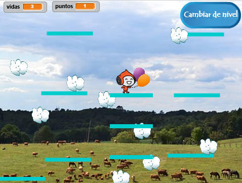

## Plataformas móviles

La razón por la que te pedí que usaras mi versión del nivel 2 es el espacio que puedes haber notado en el medio del diseño. ¡Vas a crear una plataforma que se mueva a través de este espacio y que el jugador pueda saltar y montar!



Primero, necesitarás el objeto para la plataforma.

--- task ---

Agrega un nuevo objeto, asígnale el nombre de **Plataforma móvil**, y usa las herramientas de personalización de disfraz en la pestaña Disfraces para que se vea como las otras plataformas \(use el modo vectorial\).

--- /task ---

Ahora, agreguemos algo de código al objeto.

Comienza con lo básico: para hacer que un conjunto interminable de plataformas se mueva hacia arriba de la pantalla, necesitarás clonar la plataforma a intervalos regulares. Yo elegí `4` segundos como mi intervalo. También debes asegurarte de que haya un interruptor de encendido y apagado para hacer las plataformas, de manera que no aparezcan en el nivel 1. Estoy usando una nueva variable llamada `create-platforms`{:class="block3variables"}.

--- task ---

Añade código para crear clones de tu objeto de plataforma.

Así es como el mío se ve hasta ahora:

```blocks3
+    al presionar bandera verde
+    ocultar
+    por siempre
        esperar (4) segundos
        si <(create-platforms ::variables) = [true]> entonces
            crear clon de [mí mismo v]
        fin
    fin
```

--- /task ---

--- task ---

Luego agrega el código del clon:

```blocks3
+    al comenzar como clon
+    mostrar
+    por siempre
        si <(y position) < [180]> entonces
            cambiar y por (1)
            esperar (0.02) segundos
        si no
            eliminar este clon
        fin
    fin
```

--- /task ---

Este código hace que el clon de **Moving-Platform** se mueva hacia la parte superior de la pantalla, lo suficientemente lento como para que el jugador salte, salga, y luego desaparezca.

--- task ---

Ahora haz que las plataformas desaparezcan/ reaparezcan en función de los mensajes que cambian los niveles (para que solo estén en el nivel con espacio para ellas), y el mensaje de `fin del juego`{:class="block3events"}.

```blocks3
+    al recibir [level-1 v]
+    establecer [create-platforms v] a [false]
+    ocultar

+    al recibir [level-2 v]
+    establecer [create-platforms v] a [true]

+    al recibir [fin del juego v]
+    ocultar
+    establecer [create-platforms v] a [false]
```

--- /task ---

Ahora, si intentas realmente jugar el juego, el personaje del jugador **Player Character** cae a través de la plataforma! ¿Alguna idea de por qué?

Es porque el código de la física no sabe acerca de la plataforma. En realidad es una solución rápida:

--- task ---

En el script del objeto  **Player Character**, reemplaza cada bloque `touching “Platforms”`{:class="block3sensing"} con un operador `OR`{:class="block3operators"} que comprueba **o por** `touching “Platforms”`{:class="block3sensin g"}  **o por ** `touching “Moving-Platform”`{:class="block3sensing"}.

Revisa el código del objeto **Player Character** y dondequiera que veas este bloque:

```blocks3
    <touching [Platforms v] ?>
```

reemplázalo con este:

```blocks3
    <<touching [Platforms v] ?> o <touching [Moving-Platform v] ?>>
```

--- /task ---
