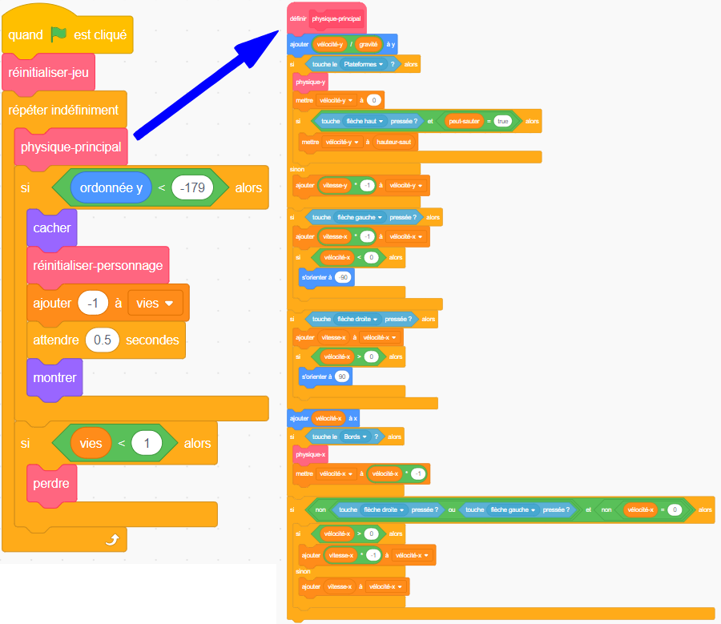

## Mise en place

Comme tu apprends Scratch et non pas à construire un moteur physique (code qui fait en sorte que les choses se comportent au moins un peu comme dans le monde réel - par exemple, ne pas tomber à travers les étages), tu commenceras avec un projet que j'ai créé et qui contient déjà les bases du déplacement, du saut et de la détection des plateformes.

Tu devrais y jeter un coup d'œil avec les détails sur cette carte, parce que tu y apporteras quelques modifications plus tard, mais tu n’as pas besoin de comprendre tout ce qu’il fait.

--- task ---

La première chose à faire est d'obtenir une copie du code de [scratch.mit.edu/projects/518237320](https://scratch.mit.edu/projects/518237320){:target="_blank"}

Pour l'utiliser hors ligne, télécharge ce code en cliquant sur **Voir à l'intérieur**, puis le menu **Fichier** et **Télécharger sur votre ordinateur**, puis ouvre-le dans Scratch sur ton ordinateur.

Tu peux également l'utiliser directement dans Scratch dans ton navigateur en cliquant simplement sur **Voir à l'intérieur** puis sur **Remix**.

--- /task ---

Le moteur physique du jeu est composé de plusieurs éléments, dont certains fonctionnent actuellement et d'autres non. Tu peux découvrir lesquelles en lançant le jeu et en essayant d'y jouer.

Tu verras que tu peux perdre des vies, mais rien ne se passe quand tu n'en as plus. En plus, le jeu n'a qu'un niveau, un type de chose à collecter, et aucun ennemi. Tu vas régler tout ça, et puis en faire un peu plus !

--- task ---

Pour l'instant, jette un œil à la manière dont le code est assemblé. Il utilise beaucoup de blocs **Mes blocs**, qui sont parfaits pour diviser ton code en morceaux afin de mieux le gérer. C'est comme avoir un bloc composé d'un grand nombre d'autres blocs, auquel tu peux donner des instructions de base.

--- /task ---

Dans le code ci-dessus, la boucle du jeu principal `répéter indéfiniment`{:class="block3control"} appelle le bloc `physique-principal`{:class="block3myblocks"} pour faire beaucoup de choses ! En les séparant ainsi, il est plus facile de lire la boucle principale et de comprendre ce qui se passe, sans se soucier de la manière **dont** cela se passe.

Maintenant, regarde `réinitialiser-jeu`{:class="block3myblocks"} et `réinitialiser-personnage`{:class="block3myblocks"} et remarque :
    1. Ils font des choses assez normales, telles que définir des variables et s'assurer que le personnage tourne correctement
    2. `réinitialiser-jeu`{:class="block3myblocks"} **appelle** `réinitialiser-personnage`{:class="block3myblocks"} — ce qui signifie que tu peux utiliser un bloc **Mes blocs** à l'intérieur d'un autre bloc **Mes blocs** !
    3. `réinitialiser-personnage`{:class="block3myblocks"} est utilisé à deux endroits différents, mais pour le changer, il suffit de modifier le code du bloc **Mes blocs** en une fois ! Cela peut t'épargner beaucoup de travail et t'aider à éviter les erreurs.
