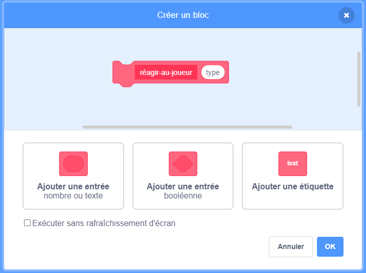

## Power-ups

Pour le moment, tu n'as qu'un seul type de collectible : un nuage de pets qui te donne un point lorsque tu l'attrapes. Sur cette carte, tu vas créer un nouveau type de collectible, d'une manière qui facilitera l'ajout d'autres types d'accessoires de collectibles. Alors tu peux inventer tes propres power-ups et bonus et vraiment personnaliser ton jeu !

J'ai déjà inclus quelques éléments pour le faire avec la variable `collectable-type`{:class="block3variables"} et le bloc `choisir-costume`{:class="block3myblocks"} **Mes blocs**. Tu vas cependant avoir besoin de les améliorer.

Jetons un coup d'œil sur le fonctionnement de collectible dès maintenant.

Dans les scripts pour le sprite `Collectable`, trouve le code `quand je commence comme un clone`{:class="block3events"}. Les blocs que tu devrais regarder sont ceux qui te donnent des points pour collecter un pet :

```blocks3
    if <touching [Personnage v]?> then
        change [points v] by (collectable-valeur ::variables)
        delete this clone
```

et celui-ci qui sélectionne un costume pour le clone :

```blocks3
    choisir-costume (collectable-type ::variables) :: custom
```

--- collapse ---
---
title: Comment fonctionne la sélection d'un costume ?
---

Le bloc `choisir-costume`{:class="block3myblocks"} fonctionne un peu comme le bloc `perdre`{:class="block3myblocks"}, mais il a quelque chose de plus : il prend une variable **entrée** appelée `type`.

```blocks3
    define choisir-costume (type)
    if <(type ::variable) = [1]> then
        switch costume to [Nuagepet v]
    end
```

Lorsque le bloc `choisir-costume`{:class="block3myblocks"} s'exécute, sa fonction est la suivante :

 1. Il regarde la variable d'entrée `type`{:class="block3myblocks"}
 1. Si la valeur de `type`{:class="block3myblocks"} est égale à `1`, elle passe au costume `Nuagepet`

Jette un coup d'œil à la partie du script qui utilise le bloc :

```blocks3
    when I start as a clone
    choisir-costume (collectable-type ::variables) :: custom
    show
    repeat until <(y position) > [170]>
        change y by (collectable-vitesse ::variables)
        if <touching [Personnage v]?> then
            change [points v] by (collectable-valeur ::variables)
            delete this clone
```

Tu peux voir que la variable `collectable-type`{:class="block3variables"} est **passée** au bloc `choisir-costume`{:class="block3myblocks"}. Dans le code de `choisir-costume`{:class="block3myblocks"}, `collectable-type`{:class="block3variables"} est alors utilisé comme variable d'entrée (`type`{:class="block3myblocks"}).

--- /collapse ---

### Ajouter un costume pour le nouveau power-up

Bien sûr, pour le moment, le sprite `Collectable` n'a qu'un costume, puisqu'il n'y a qu'un seul type de collectable. Tu es sur le point de changer cela !

--- task ---

Ajoute un nouveau costume au sprite `Collectable` pour ton nouveau power-up. J'ai dessiné un nuage de pets géant, mais tu peux faire ce que tu veux !

--- /task ---

--- task ---

Ensuite tu dois dire au bloc `choisir-costume`{:class="block3myblocks"} **Mes blocs** pour définir le nouveau costume chaque fois qu'il obtient la nouvelle valeur pour `type`, comme ceci (en utilisant le nom du costume que tu as choisis) :

```blocks3
    define choisir-costume (type)
    if <(type ::variable) = [1]> then
        switch costume to [Nuagepet v]
    end
+    if <(type ::variable) = [2]> then
        switch costume to [superPet v]
    end
```

--- /task ---

### Créer le code du power-up

Maintenant tu dois décider ce que fera le nouveau collectable. Nous allons commencer avec quelque chose de simple : donner une nouvelle vie au joueur. Sur la carte suivante, tu feras quelque chose de plus cool.

--- task ---

Va dans la section **Mes blocs** et clique sur **Créer un bloc**. Nomme le nouveau bloc `réagir-au-joueur`{:class="block3myblocks"} et ajoute un **nombre entrée** nommé `type`{:class="block3myblocks"} .



Clique sur **OK**.

--- /task ---

--- task ---

Fais que le bloc `réagir-au-joueur`{:class="block3myblocks"} augmente les points ou augmente la vie du joueur, selon la valeur de `type`{:class="block3myblocks"} .

```blocks3
+    define réagir-au-joueur (type)
+    if <(type ::variable) = [1]> then
        change [points v] by (collectable-valeur ::variables)
    end
+   if <(type ::variable) = [2]> then
        change [vies v] by [1]
    end
```

--- /task ---

--- task ---

Mets à jour le code `quand je commence comme un clone`{:class="block3events"} pour remplacer le bloc qui ajoute un point avec un **appel** à `réagir-au-joueur`{:class="block3myblocks"}, **en passant** `collectable-type`{:class="block3variables"}. En utilisant ce bloc **Mes blocs** , les nuages de pets normaux ajoutent encore un point, et le nouveau power-up ajoute une vie.

```blocks3
    if <touching [Personnage v] ?> then
+        réagir-au-joueur (collectable-type ::variables) :: custom
        delete this clone
    end
```

--- /task ---

### En utilisant `collectable-type`{:class="block3variables"} pour créer des collectables différents au hasard

En ce moment, tu te demandes peut-être comment tu vas dire à chaque collectable que le jeu fait quel type il doit être.

Tu le fais en définissant la valeur de `collectable-type`{:class="block3variables"}. Cette variable est juste un nombre. Comme tu l'as vu, il est utilisé pour dire aux blocs `choisir-costume`{:class="block3myblocks"} et `réagir-au-joueur`{:class="block3myblocks"} quel costume, règles, etc. à utiliser pour le collectable.

--- collapse ---
---
title: Travailler avec des variables dans un clone
---

Pour chaque clone du sprite `Collectable`, tu peux définir une valeur différente pour `collectable-type`{:class="block3variables"}.

Penses-y quand tu crées une nouvelle copie du sprite `Collectable` à l'aide de la valeur stockée dans `collectable-type`{:class="block3variables"} au moment de la création du clone `Collectable`.

Une des choses qui rend les clones spéciaux est qu'ils ne peuvent pas changer les valeurs des variables avec lesquelles ils commencent. Ils ont effectivement des **valeurs** constantes. Cela signifie que lorsque tu changes la valeur de `collectable-type`{:class="block3variables"}, cela n'affecte pas les clones de sprite `Collectable` qui sont déjà dans le jeu.

--- /collapse ---

Tu vas définir le `collectable-type`{:class="block3variables"} soit à `1` soit à `2` pour chaque nouveau clone que tu fais. Nous allons choisir le nombre au hasard, pour faire un collectable aléatoire à chaque fois et garder les choses intéressantes.

--- task ---

Trouve la boucle `répéter jusqu'à ce que`{:class="block3control"} dans le code du drapeau vert pour le sprite `Collectable` et ajoute le code `si...sinon`{:class="block3control"} affiché ci-dessous.

```blocks3
    repeat until <not <(créer-collectables ::variables) = [true]>>
+        if <[50] = (pick random (1) to (50))> then
            set [collectable-type v] to [2]
        else
            set [collectable-type v] to [1]
        end
        wait (collectable-fréquence ::variables) secs
        go to x: (pick random (-240) to (240)) y: (-179)
        create clone of [myself v]
```

--- /task ---

Ce code donne 1 chance sur 50 de définir le `collectable-type`{:class="block3variables"} à `2`.

Génial ! Maintenant tu as un nouveau type de collectable qui apparaît parfois au lieu du nuage de pets, et cela te donne une vie supplémentaire au lieu d'un point quand tu le collecteras !
