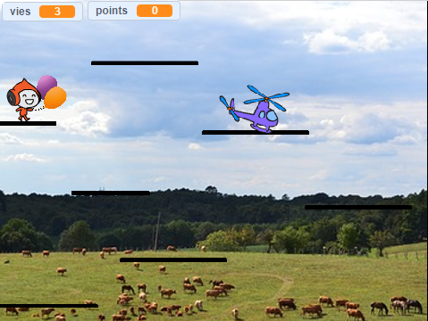

## Ajouter de la difficulté

Ton jeu fonctionne et tu peux maintenant accumuler des points, obtenir des pouvoirs spéciaux grâce à des power-ups, et perdre. Voilà qui est mieux ! Peut-être serait-il amusant d'ajouter un peu de difficulté — que dis-tu d'ajouter un personnage qui se déplace un peu, mais que tu n'es pas censé toucher ? Cela ressemblera aux ennemis des jeux de plateforme traditionnels comme Super Mario, dont nous nous sommes inspirés.

--- task ---

Tout d'abord, choisis un sprite à ajouter comme ennemi. Comme notre personnage est dans le ciel, j'ai choisi un hélicoptère. Il y a beaucoup d'autres sprites que tu pourrais ajouter. J'ai également renommé le sprite `Ennemi`, juste pour que les choses soient plus claires pour moi.

Redimensionne le sprite à la bonne taille et place-le à un endroit approprié pour commencer. Voici à quoi ressemble le mien :



--- /task ---

--- task ---

Commence par écrire le code le plus simple : configure son bloc pour le message `partie terminée`{:class="block3events"} afin de faire disparaître l'ennemi lorsque le joueur perd la partie.

```blocks3
+    when I receive [partie terminée v]
+    hide
```

--- /task ---

--- task ---

Maintenant, tu dois écrire le code pour ce que fait l'ennemi. Tu peux utiliser le mien de cette carte, mais n'aie pas peur d'en ajouter plus ! (Et s'ils se téléportent sur différentes plateformes ? Ou s'il y a un power-up qui les rend plus rapides ou plus lents ?)

```blocks3
+    when green flag clicked
+    show
+    set [ennemi-déplacement-pas v] to [5]
+    set rotation style [left-right v]
+    go to x: (1) y: (59)
+    forever
        move (ennemi-déplacement-pas) steps
        if <not <touching [Plateformes v] ?>> then
            set [ennemi-déplacement-pas v] to ((ennemi-déplacement-pas) * (-1))
        end
    end
```

**Note** : si tu fais juste glisser le bloc `aller à`{:class="block3motion"} et ne change pas les valeurs `x` et `y` , elles seront les valeurs de l'emplacement actuel du sprite !

--- /task ---

Le code dans le bloc `si...alors`{:class="block3control"} fera tourner l'ennemi quand il arrivera au bout de la plateforme.

La prochaine chose dont tu as besoin est que le joueur perd une vie quand il touche l’ennemi. Tu dois t'assurer qu'ils **stoppent** de se toucher très rapidement, car sinon le code de toucher continuera à fonctionner et ils continueront à perdre des vies.

--- task ---

Voici comment je l'ai fait, mais n'hésite pas à essayer d'améliorer ce code ! J’ai modifié le bloc principal du sprite `Personnage`. Ajoute le code avant le bloc `si`{:class="block3control"} qui vérifie si tu es à court de vie.

```blocks3
+    if <touching [Ennemi v] ?> then
        hide
        go to x: (-187) y: (42)
        change [vies v] by (-1)
        wait (0.5) secs
        show
    end
```

--- /task ---

--- collapse ---
---
title: Montre-moi l'ensemble du script mis à jour
---

Le bloc principal de mon sprite `Personnage` ressemble maintenant à ceci :

```blocks3
    when green flag clicked
    réinitialiser-jeu :: custom
    forever
        physique-principal :: custom
        if <(y position) < [-179]> then
            hide
            réinitialiser-personnage :: custom
            change [vies v] by (-1)
            wait (0.05) secs
            show
        end
        if <touching [Ennemi v] ?> then
            hide
            go to x: (-187) y: (42)
            change [vies v] by (-1)
            wait (0.5) secs
            show
        end
        if <(vies) < [1]> then
            perdre :: custom
        end
    end
```

--- /collapse ---

Le nouveau code masque le personnage, les remet à leur position de départ, réduit `vies`{:class="block3variables"} à `1`, et après une demi-seconde les fait réapparaître.
