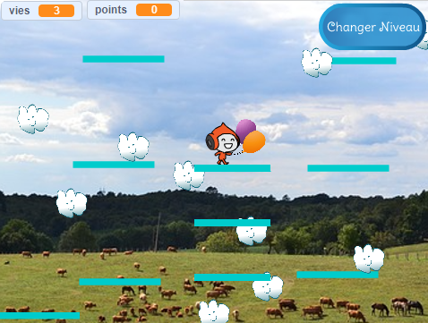

## Plateformes mobiles

La raison pour laquelle je t'ai demandé d'utiliser ma version de niveau 2 est l'écart que tu aurais pu remarquer au milieu de la disposition. Tu vas créer une plateforme qui traverse cet écart et sur laquelle le joueur peut sauter et monter !



D'abord, tu auras besoin du sprite pour la plateforme.

--- task ---

Ajoute un nouveau sprite, nomme-le **Plateforme-mobile** et en utilisant les outils de personnalisation des costumes dans l'onglet « Costumes » pour le faire ressembler aux autres plateformes (utilise le mode vectoriel).

--- /task ---

Now, let's add some code to the sprite.

Commence par les bases : pour créer un ensemble infini de plateformes remontant l'écran, tu devras cloner la plateforme à intervalles réguliers. J'ai choisi `4` secondes comme intervalle. Tu dois également t'assurer qu'il y a un interrupteur marche/arrêt pour créer les plateformes, afin qu'elles n'apparaissent pas au niveau 1. J'utilise une nouvelle variable appelée `créer-plateformes`{:class="block3variables"}.

--- task ---

Ajoute du code pour créer des clones de ton sprite Plateformes.

Voici à quoi ressemble le mien jusqu'à présent :

```blocks3
+    quand le drapeau est cliqué
+    cacher
+    répéter indéfiniment
        attendre (4) secs
        si <(créer-plateformes ::variables) = [true]> alors
            créer un clone de [moi-même v]
        fin
    fin
```

--- /task ---

--- task ---

Ajoute ensuite le code du clone :

```blocks3
+    quand je commence comme un clone
+    montrer
+    répéter indéfiniment
        si <(ordonnée y) < [180]> alors
            ajouter (1) à y
            attendre (0.02) secs
        sinon
            supprimer ce clone
        fin
    fin
```

--- /task ---

Ce code fait que le clone **Plateforme-mobile** se déplace vers le haut de l'écran, suffisamment lentement pour que le joueur puisse monter et descendre, puis disparaitre.

--- task ---

Fais maintenant disparaître/réapparaître les plateformes en fonction des diffusions qui changent de niveau (pour qu'elles ne soient que sur le niveau où il y a de la place pour elles), et le message `partie terminée`{:class="block3events"} .

```blocks3
+    quand je reçois [niveau-1 v]
+    mettre [créer-plateformes v] à [faux]
+    cacher

+    quand je reçois [niveau-2 v]
+    mettre [créer-plateformes v] à [vrai]

+    quand je reçois [partie terminée v]
+    cacher
+    mettre [créer-plateformes v] à [faux]
```

--- /task ---

Maintenant, si tu essaies de jouer au jeu, le **Personnage** tombe à travers la plateforme ! Tu sais pourquoi ?

C’est parce que le code physique ne connaît pas la plateforme. C'est simple à corriger :

--- task ---

Dans les scripts **Personnage**, remplace tous les blocs `« Plateformes »`{:class="block3sensing"} avec un opérateur `OU`{:class="block3operators"} qui vérifie **soit** `touche les « Plateformes »`{:class="block3sensing"} **OU** `touche la « Plateforme-mobile »`{:class="block3sensing"}.

Parcours le code du sprite **Personnage** et partout où tu vois ce bloc :

```blocks3
    <touching [Platforms v] ?>
```

remplace-le par celui-ci :

```blocks3
    <<touching [Platforms v] ?> ou <touching [Moving-Platform v] ?>>
```

--- /task ---
