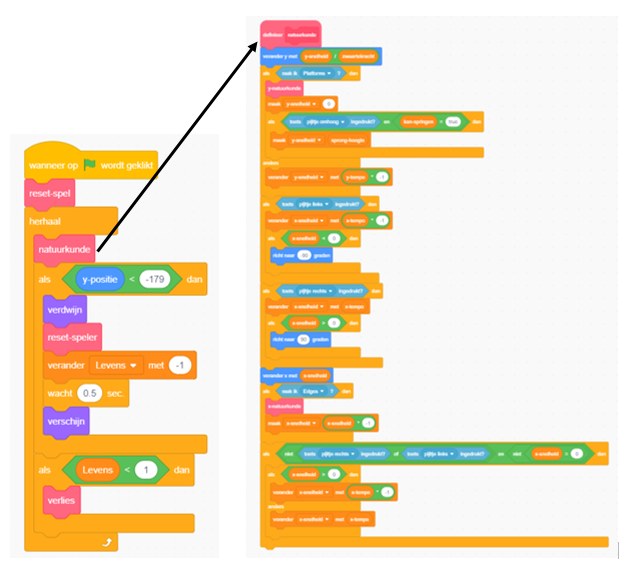

## De voorbereidingen

Omdat je Scratch leert en niet hoe je een natuurkundige machine moet bouwen (code die ervoor zorgt dat dingen zich op zijn minst een beetje gedragen als de echte wereld - bijvoorbeeld niet door vloeren vallen), begin je met een project dat ik al heb gemaakt, het bevat de basis voor het verplaatsen, springen en detecteren van platforms ingebouwd.

Kijk ernaar, inclusief de details op deze kaart, want je zult er later wat wijzigingen in aanbrengen, maar je hoeft niet alles te begrijpen wat het doet.

--- task ---

Het eerste dat je moet doen, is de code van [dojo.soy/platform-starter](http://dojo.soy/platform-starter){:target="_blank"} kopiëren

Als je het offline wilt gebruiken, download je deze code door te klikken op **Bekijk van binnen**, vervolgens op het menu **Bestand** en **Opslaan op je computer** en open het vervolgens in Scratch op je computer.

Je kunt het ook gebruiken door rechtstreeks in Scratch te klikken op **Bekijk van binnen** en dan (als je ingelogt bent) **Remix**.

--- /task ---

De natuurkundige machine van het spel heeft een verscheidenheid aan onderdelen, waarvan sommige nu werken en sommige niet. Je kunt erachter komen door het spel proberen te spelen.

Je zult zien dat je levens kunt verliezen, maar er gebeurt niets wanneer je geen levens meer hebt. Ook heeft de game maar één level, één soort prijzen om te verzamelen en geen vijanden. Je gaat dat allemaal oplossen, en een beetje meer!

--- task ---

Kijk eerst eens hoe de code is samengesteld. Het gebruikt veel blokken van **Mijn blokken**, die ideaal zijn om je code in stukken te splitsen, zodat je ze beter kunt beheren. Het is alsof je een blok hebt dat uit veel andere blokken bestaat, waaraan je enkele basisinstructies kunt geven.

--- /task ---

In de bovenstaande code roept de `herhaal`{:class="block3control"} lus van het hoofdspel het `natuurkunde`{:class="block3myblocks"} blok aan om een heleboel dingen te doen! Ze gescheiden houden op deze manier maakt het gemakkelijk om de belangrijkste lus lezen en te begrijpen wat er wanneer gebeurt, zonder zorgen over **hoe** het gebeurt.

Kijk nu naar de `reset spel`{:class = "block3myblocks"} en `reset speler`{:class="block3myblocks"} blokken en merk op:
    1. Ze doen behoorlijk normale dingen, zoals het instellen van variabelen en ervoor zorgen dat het personage op de juiste manier ronddraait
    2. `reset spel`{:class="block3myblocks"} **roept** `reset speler`{:class="block3myblocks"} aan - wat betekent dat je een **Mijn blokken** blok in een ander **Mijn blokken** blok kunt gebruiken!
    3. `reset speler`{:class="block3myblocks"} wordt op twee verschillende plaatsen gebruikt, maar om het te wijzigen, hoef je alleen de code van het **Mijn blokken** blok op één plaats te wijzigen! Dit kan je veel werk besparen en fouten helpen voorkomen.
