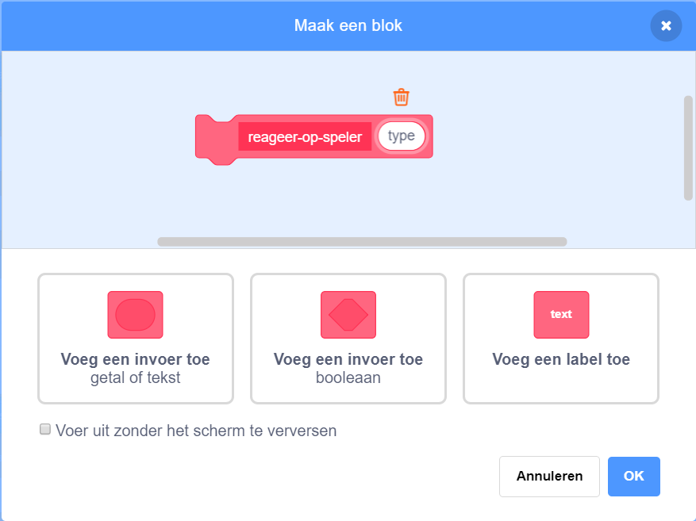

## Power-ups

Op dit moment heb je maar één type prijs: een scheetwolk die je één punt geeft als je hem grijpt. Op deze kaart ga je een nieuw type prijs maken, op een manier die het toevoegen van andere soorten prijzen eenvoudig maakt. Dan kun je je eigen power-ups en bonussen verzinnen en echt je eigen spel maken!

Ik heb hier al enkele stukjes voor toegevoegd met de `prijs-type`{:class="block3variables"} variabele en het `verander uiterlijk`{:class="block3myblocks"} **Mijn blokken** blok. Je zult ze echter moeten verbeteren.

Laten we eens kijken hoe de prijs nu werkt.

Zoek in de scripts voor de `Collectable` sprite de `wanneer ik als kloon start`{:class="block3events"} code. De blokken waar je naar moet kijken, zijn de blokken die je punten geven voor het verzamelen van een scheet:

```blocks3
    if <touching [Player Character v]?> then
        change [punten v] by (prijs-waarde ::variables)
        delete this clone
```

en deze die een uiterlijk voor de kloon selecteert:

```blocks3
    kies uiterlijk (prijs-type ::variables) :: custom
```

--- collapse ---
---
title: Hoe werkt het kiezen van een uiterlijk?
---

Het `kies uiterlijk`{:class="block3myblocks"} blok werkt een beetje zoals het `verlies`{:class="block3myblocks"} blok, maar het heeft iets extra's: er is een variabele met **invoer**, `type` genaamd.

```blocks3
    define kies uiterlijk (type)
    if <(type ::variable) = [1]> then
        switch costume to [fartCloud v]
    end
```

Wanneer het blok `kies uiterlijk`{:class="block3myblocks"} wordt uitgevoerd, doet het hier het volgende:

 1. Het kijkt naar `type`{:class="block3myblocks"} in de invoer variabele
 1. Als de waarde van `type`{:class="block3myblocks"} gelijk is aan `1`, schakelt deze over naar het `fartCloud` uiterlijk

Bekijk het deel van het script dat het blok gebruikt:

```blocks3
    when I start as a clone
    kies uiterlijk (prijs-type ::variables) :: custom
    show
    repeat until <(y position) > [170]>
        change y by (prijs-tempo ::variables)
        if <touching [Player Character v]?> then
            change [punten v] by (prijs-waarde ::variables)
            delete this clone
```

Je kunt zien dat de `prijs-type`{:class="block3variables"} variabele **doorgezet wordt** naar het blok `kies uiterlijk`{:class="block3myblocks"}. Binnen de code voor `kies uiterlijk`{:class="block3myblocks"}, wordt `prijs-type`{:class="block3variables"} vervolgens gebruikt als de invoervariabele (`type`{:class="block3myblocks"}).

--- /collapse ---

### Voeg een uiterlijk toe voor de nieuwe power-up

Natuurlijk heeft de sprite van `Collectable` maar één uiterlijk, omdat er maar één type prijs is. Je staat op het punt om dat te veranderen!

--- task ---

Voeg een nieuw uiterlijk toe aan de `Collectable` sprite voor je nieuwe power-up. Ik heb een supersize scheetwolk getekend, maar je kunt maken wat je maar wilt!

--- /task ---

--- task ---

Vervolgens moet je het `kies uiterlijk`{:class="block3myblocks"} **Mijn blokken** blok vertellen om het nieuwe uiterlijk in te stellen wanneer het de nieuwe waarde voor `type` ontvangt, zoals dit \(met behulp van de uiterlijknaam die je hebt gekozen\):

```blocks3
    define kies uiterlijk (type)
    if <(type ::variable) = [1]> then
        switch costume to [fartCloud v]
    end
+    if <(type ::variable) = [2]> then
        switch costume to [superFart v]
    end
```

--- /task ---

### Maak de code voor de power-up

Nu moet je beslissen wat de nieuwe prijs zal doen. We beginnen met iets eenvoudigs: de speler een nieuw leven geven. Op de volgende kaart laat je het iets coolers doen.

--- task ---

Ga naar het gedeelte **Mijn blokken** en klik op **Maak een blok**. Noem het nieuwe blok `reageer-op-speler`{:class="block3myblocks"} en voeg een **invoer** toe met de naam `type`{:class="block3myblocks"}.



Klik op **OK**.

--- /task ---

--- task ---

Laat het `reageer-op-speler`{:class="block3myblocks"} blok de punten verhogen of de levensduur van de speler verlengen, afhankelijk van de waarde van `type`{:class="block3myblocks"}.

```blocks3
+    define reageer-op-speler (type)
+    if <(type ::variable) = [1]> then
        change [punten v] by (prijs-waarde ::variables)
    end
+   if <(type ::variable) = [2]> then
        change [levens v] by [1]
    end
```

--- /task ---

--- task ---

Werk de `wanneer ik als kloon start`{:class="block3events"} code bij om het blok dat een punt toevoegt te vervangen door een **aanroep** naar `reageer-op-speler`{:class="block3myblocks"}, `prijs-type`{:class="block3variables"} **doorgevend**. Door dit **Mijn blokken** blok te gebruiken, voegen normale scheetwolken nog steeds een punt toe en voegt de nieuwe power-up een leven toe.

```blocks3
    if <touching [Player Character v] ?> then
+        reageer-op-speler (prijs-type ::variables) :: custom
        delete this clone
    end
```

--- /task ---

### Gebruik `prijs-type`{:class="block3variables"} om willekeurig verschillende prijzen te maken

Op dit moment vraag je je wellicht af hoe je elke prijs dat het spel maakt, kunt vertellen welk type het zou moeten zijn.

Je doet dit door de waarde van `prijs-type`{:class="block3variables"} in te stellen. Deze variabele is slechts een getal. Zoals je hebt gezien, wordt het gebruikt om de `kies uiterlijk`{:class="block3myblocks"} en `reageer-op-speler`{:class="block3myblocks"} blokken te vertellen welk uiterlijk, regels, enz. te gebruiken voor de prijs.

--- collapse ---
---
title: Werken met variabelen in een kloon
---

Voor elke kloon van de `Collectable` sprite kun je een andere waarde instellen voor `prijs-type`{:class="block3variables"}.

Zie het als het maken van een nieuwe kopie van de `Collectable` sprite met de waarde die is opgeslagen in `prijs-type`{:class="block3variables"} op het moment dat een `Collectable` kloon wordt gemaakt.

Een van de dingen die klonen bijzonder maakt, is dat ze de waarden van variabelen waarmee ze beginnen niet kunnen wijzigen. Ze hebben effectief **constante** waarden. Dat betekent dat wanneer je de waarde van `prijs-type`{:class="block3variables"} wijzigt, dit niet van invloed is op de `Collectable` sprite-klonen die al in het spel aanwezig zijn.

--- /collapse ---

Je gaat het `prijs-type`{:class="block3variables"} instellen op `1` of `2` voor elke nieuwe kloon die je maakt. Laten we het getal willekeurig kiezen, zodat we elke keer een willekeurige prijs kunnen maken en dingen interessant kunnen houden.

--- task ---

Zoek de `herhaal tot`{:class="block3control"} lus in de groene vlag code voor de `Collectable` sprite, en voeg de `als... anders`{:class="block3control"} code toe zoals hieronder weergegeven.

```blocks3
    repeat until <not <(create-collectables ::variables) = [true]>>
+        if <[50] = (pick random (1) to (50))> then
            set [prijs-type v] to [2]
        else
            set [prijs-type v] to [1]
        end
        wait (prijs-frequentie ::variables) secs
        go to x: (pick random (-240) to (240)) y: (-179)
        create clone of [myself v]
```

--- /task ---

Deze code geeft een kans van 1 op 50 om `prijs-type`{:class="block3variables"} in te stellen op `2`.

Geweldig! Nu heb je een nieuw type prijs dat soms verschijnt in plaats van de scheetwolk, en dat je een extra leven geeft in plaats van een punt wanneer je het verzamelt!
