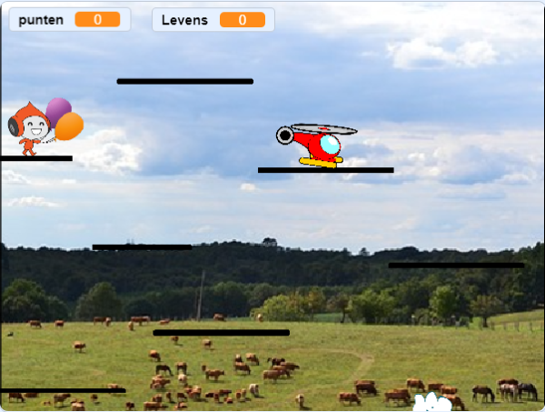

## Wedstrijdelement toevoegen

Je game werkt en nu kun je punten verzamelen, speciale power-ups verdienen en verliezen. Het wordt al wat! Misschien is het leuk om een wedstrijdelement toe te voegen - zoals bijvoorbeeld een personage dat een beetje beweegt, maar dat je niet aan mag raken? Dit lijkt op vijanden in de traditionele platformgames \(zoals Super Mario\) waar we ons hier door laten inspireren.

--- task ---

Kies eerst een sprite om toe te voegen als je vijand. Omdat onze speler door de lucht beweegt, heb ik voor een helikopter gekozen. Er zijn echter nog veel andere sprites die je zou kunnen gebruiken. Ik heb de sprite ook hernoemd naar `Enemy`, gewoon om dingen duidelijker voor me te maken.

Verklein de sprite naar de juiste grootte en plaats deze op een geschikte plaats om te beginnen. Dit is hoe de mijne eruit ziet:



--- /task ---

--- task ---

Schrijf eerst de eenvoudigere code: stel het blok in voor het `game over`{:class= "block3events"} -bericht om de vijand te laten verdwijnen wanneer de speler het spel verliest.

```blocks3
+    when I receive [game-over v]
+    hide
```

--- /task ---

--- task ---

Nu moet je de code schrijven voor wat de vijand doet. Je kunt de mijne van deze kaart gebruiken, maar wees niet bang om meer toe te voegen! (Wat als ze naar verschillende platforms teleporteren? Of wat als er een power-up is waardoor ze sneller of langzamer bewegen?)

```blocks3
+    when green flag clicked
+    show
+    set [enemy-neemt-stappen v] to [5]
+    set rotation style [left-right v]
+    go to x: (1) y: (59)
+    forever
        move (enemy-neemt-stappen) steps
        if <not <touching [Platforms v] ?>> then
            set [enemy-neemt-stappen v] to ((enemy-neemt-stappen) * (-1))
        end
    end
```

**Opmerking**: als je het `ga naar`{:class="block3motion"} blok sleept en de `x` en `y` waarden niet wijzigt, zijn dit de waarden voor de huidige locatie van de sprite!

--- /task ---

De code in het `als...dan`{:class="block3control"} blok zorgt ervoor dat de vijand zich omdraait wanneer ze het einde van het platform bereiken.

Het volgende dat je nodig hebt, is dat de speler een leven verliest wanneer hij de vijand aanraakt. Je moet zorgen dat ze heel snel **stoppen**, omdat anders de aanraak code zal blijven draaien en ze levens blijven te verliezen.

--- task ---

Hier is hoe ik het deed, maar voel je vrij om te proberen deze code te verbeteren! Ik heb het hoofdblok van `Player Character` sprite aangepast. Voeg de code toe voor het `als`{:class="block3control"} blok dat controleert of je geen levens meer hebt.

```blocks3
+    if <touching [Enemy v] ?> then
        hide
        go to x: (-187) y: (42)
        change [levens v] by (-1)
        wait (0.5) secs
        show
    end
```

--- /task ---

--- collapse ---
---
title: Laat me het hele bijgewerkte script zien
---

Het hoofdblok van mijn `Player Character` sprite ziet er nu zo uit:

```blocks3
    when green flag clicked
    reset-spel :: custom
    forever
        nauurkunde :: custom
        if <(y positie) < [-179]> then
            hide
            reset-speler :: custom
            change [levens v] by (-1)
            wait (0.05) secs
            show
        end
        if <touching [Enemy v] ?> then
            hide
            go to x: (-187) y: (42)
            change [levens v] by (-1)
            wait (0.5) secs
            show
        end
        if <(levens) < [1]> then
            verlies:: custom
        end
    end
```

--- /collapse ---

De nieuwe code verbergt het karakter, verplaatst ze terug naar hun startpositie, vermindert `levens`{:class="block3variables"} met `1`en laat ze na een halve seconde opnieuw verschijnen.
