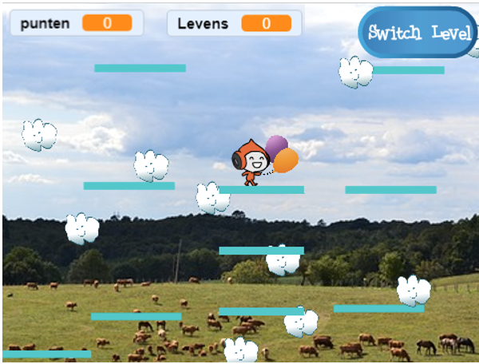

## Bewegende platforms

De reden waarom ik je heb gevraagd om mijn versie van level 2 te gebruiken, is de opening die je misschien midden in de opmaak hebt gezien. Je gaat een platform creëren dat zich door dit gat beweegt en waar de speler op kan springen om zich voort te bewegen!



Ten eerste heb je de sprite voor het platform nodig.

--- task ---

Voeg een nieuwe sprite toe, noem deze **Bewegend-Platform**, en gebruik de uiterlijkgereedschappen in Uiterlijken om het op de andere platforms te laten lijken (gebruik de vectormodus).

--- /task ---

Laten we nu wat code toevoegen aan de sprite.

Begin met de basis: om een nooit eindigende verzameling platforms op het scherm te laten bewegen, moet je het platform regelmatig klonen. Ik koos `4` seconden als mijn interval. Je moet ook zorgen dat er een aan/uit schakelaar is om de platforms te maken, zodat ze niet op level 1 verschijnen. Ik gebruik een nieuwe variabele genaamd `maak-platforms`{:class="block3variables"}.

--- task ---

Voeg code toe om klonen van je platform sprite te maken.

Dit is hoe de mijne er nu uitziet:

```blocks3
+    when green flag clicked
+    hide
+    forever
        wait (4) secs
        if <(maak-platforms ::variables) = [true]> then
            create clone of [myself v]
        end
    end
```

--- /task ---

--- task ---

Voeg vervolgens de klooncode toe:

```blocks3
+    when I start as a clone
+    show
+    forever
        if <(y position) < [180]> then
            change y by (1)
            wait (0.02) secs
        else
            delete this clone
        end
    end
```

--- /task ---

Deze code zorgt ervoor dat de kloon van **Bewegend-Platform** naar de bovenkant van het scherm wordt verplaatst, langzaam genoeg zodat de speler erop en eraf kan springen, en vervolgens verdwijnt.

--- task ---

Laat nu de platforms verdwijnen/verschijnen op basis van de signalen die levels veranderen (dus ze zijn alleen op het level waar ruimte voor hen is), en het `game over`{:class="block3events"} bericht.

```blocks3
+    when I receive [level-1 v]
+    set [maak-platforms v] to [false]
+    hide

+    when I receive [level-2 v]
+    set [maak-platforms v] to [true]

+    when I receive [game over v]
+    hide
+    set [maak-platforms v] to [false]
```

--- /task ---

Als je nu probeert om het spel daadwerkelijk te spelen, valt de **Speler** door het platform! Enig idee waarom?

Het is omdat de natuurkunde code nog niets weet over het platform. Er is een snelle oplossing:

--- task ---

Vervang in de **Player Character** sprite alle `raak ik "Platforms"`{:class="block3sensing"} blokken door een `OF`{:class="block3operators"} operator die controleert op **of** `raak ik "Platforms"`{:class= "block3sensing"}  **OF** `raak ik "Bewegend-Platform "`{:class="block3sensing"}.

Doorloop de code voor de **Player Character** sprite en overal waar je dit blok ziet:

```blocks3
<touching [Platforms v] ?>
```

vervang het door deze:

```blocks3
<<touching [Platforms v] ?> or <touching [Bewegend-Platform v] ?>>
```

--- /task ---
